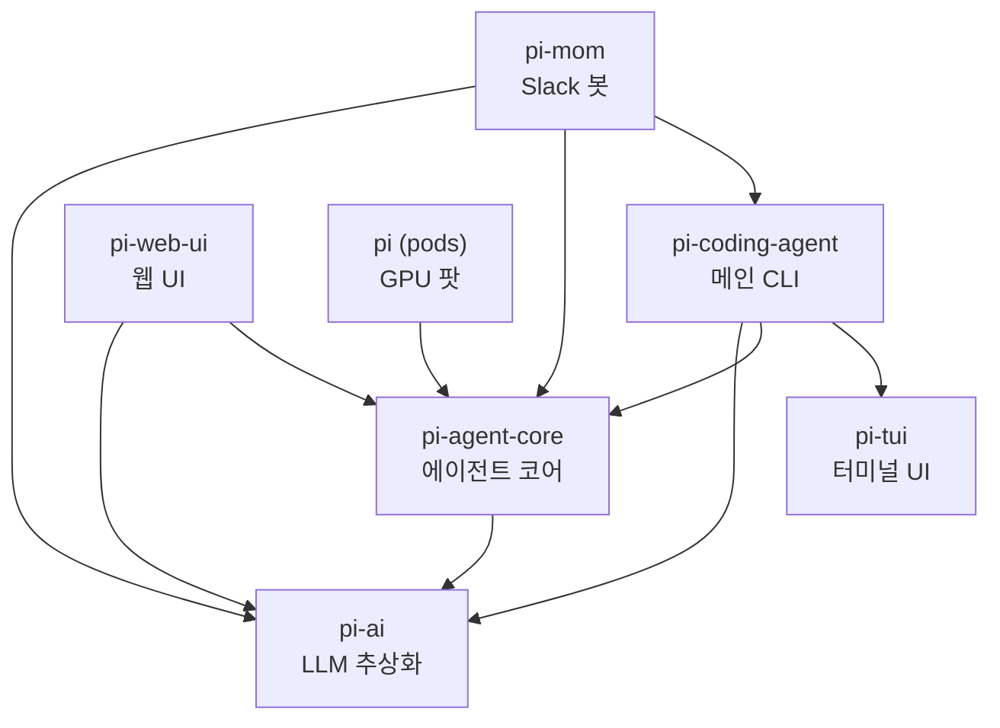
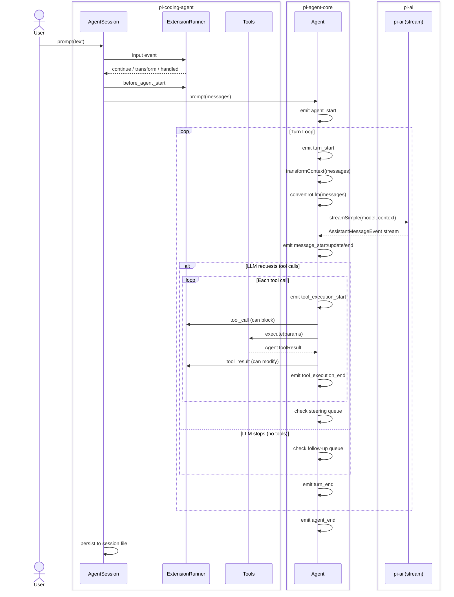
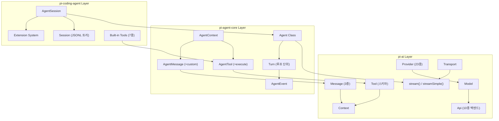
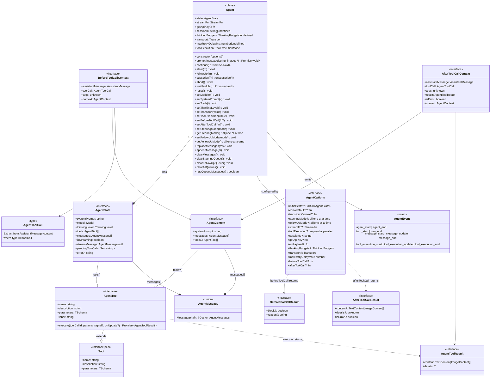

# pi-coding-agent 리서치 문서

> 버전: v0.62.0 | 작성일: 2026-03-23

## 목차

- [1. 개요](#1-개요)
  - [1.1 pi-mono란?](#11-pi-mono란--모노레포-전략과-패키지-경계)
  - [1.2 pi-coding-agent 포지셔닝](#12-pi-coding-agent-포지셔닝)
  - [1.3 왜 만들었나](#13-왜-만들었나--설계-철학과-배경)
- [2. 아키텍처](#2-아키텍처)
  - [2.1 전체 패키지 구조 & 의존 그래프](#21-전체-패키지-구조--의존-그래프)
  - [2.2 레이어 분리 원칙](#22-레이어-분리-원칙-ai--agent--tui--coding-agent)
  - [2.3 데이터 흐름](#23-데이터-흐름--사용자-입력--llm-호출--툴-실행--출력)
  - [2.4 엔진-UI 분리 패턴](#24-엔진-ui-분리-패턴)
- [3. Core Concepts](#3-core-concepts)
  - [3.1 Provider](#31-provider)
  - [3.2 Api](#32-api)
  - [3.3 Model](#33-model)
  - [3.4 Tool / AgentTool](#34-tool--agenttool)
  - [3.5 Message / AgentMessage](#35-message--agentmessage)
  - [3.5 Context (AgentContext)](#35-context-agentcontext)
  - [3.6 Turn](#36-turn)
  - [3.7 Session](#37-session)
  - [3.8 Transport](#38-transport)
  - [3.9 개념 간 상호작용 다이어그램](#39-개념-간-상호작용-다이어그램)
- [4. packages/ai -- LLM 통합 추상화 계층](#4-packagesai--llm-통합-추상화-계층)
  - [4.1 Unified API 설계](#41-unified-api-설계)
  - [4.2 지원 프로바이더 목록 & 연결 방식](#42-지원-프로바이더-목록--연결-방식)
  - [4.3 모델 레지스트리 & 자동 탐지](#43-모델-레지스트리--자동-탐지)
  - [4.4 스트리밍 & 툴 콜 처리 방식](#44-스트리밍--툴-콜-처리-방식)
- [5. packages/agent -- 에이전트 코어 런타임](#5-packagesagent--에이전트-코어-런타임)
  - [5.1 Agent 클래스 설계](#51-agent-클래스-설계)
  - [5.2 에이전트 런 루프 구조](#52-에이전트-런-루프-구조)
  - [5.3 툴 실행 파이프라인](#53-툴-실행-파이프라인-병렬--순차)
  - [5.4 이벤트 시스템](#54-이벤트-시스템)
  - [5.5 훅 시스템](#55-훅-시스템-beforetoolcall--aftertoolcall)
  - [5.6 Steering & Follow-up 메시지](#56-steering--follow-up-메시지)
- [6. packages/coding-agent -- 메인 CLI 에이전트](#6-packagescoding-agent--메인-cli-에이전트)
  - [6.1 내장 툴 7종](#61-내장-툴-7종)
  - [6.2 동작 모드](#62-동작-모드-interactive-tui--print--rpc)
  - [6.3 시스템 프롬프트 구조](#63-시스템-프롬프트-구조)
  - [6.4 컨텍스트 압축 (Compaction)](#64-컨텍스트-압축-compaction)
  - [6.5 세션 히스토리 & 브랜칭](#65-세션-히스토리--브랜칭)
  - [6.6 SDK로 프로그래밍 방식 사용](#66-sdk로-프로그래밍-방식-사용)
- [7. 비교 분석 -- 철학적 차이](#7-비교-분석--철학적-차이)
  - [7.1 Claude Code / OpenCode](#71-claude-code--opencode)
  - [7.2 CrewAI / LangGraph](#72-crewai--langgraph--선형-루프-vs-그래프-기반-오케스트레이션)
  - [7.3 플랫폼 구축 관점에서의 시사점](#73-플랫폼-구축-관점에서의-시사점)
- [8. 설치 & 운영](#8-설치--운영)
  - [8.1 npm 설치](#81-npm-설치)
  - [8.2 소스 빌드 & 개발 환경](#82-소스-빌드--개발-환경)
  - [8.3 LLM 프로바이더 설정](#83-llm-프로바이더-설정)
  - [8.4 mom (Slack 봇 + Docker 샌드박스) 운영](#84-mom-slack-봇--docker-샌드박스-운영)
- [9. Extension 시스템 심화](#9-extension-시스템-심화)
  - [9.1 확장 모델 개요](#91-확장-모델-개요)
  - [9.2 커스텀 LLM 프로바이더 구현](#92-커스텀-llm-프로바이더-구현)
  - [9.3 Skills 작성](#93-skills-작성)
  - [9.4 Prompt Templates](#94-prompt-templates)
  - [9.5 Themes](#95-themes)
  - [9.6 실전 예제](#96-실전-예제)
- [10. Event / Hook 전체 레퍼런스](#10-event--hook-전체-레퍼런스)
  - [10.1 레이어별 Hook / Event 전체 표](#101-레이어별-hook--event-전체-표)
  - [10.2 유저 프롬프트 → 응답 전체 Sequence (Hook 포함)](#102-유저-프롬프트--응답-전체-sequence-hook-포함)
- [11. UI 계층 패키지들](#11-ui-계층-패키지들)
  - [11.1 packages/tui](#111-packagestui)
  - [11.2 packages/web-ui](#112-packagesweb-ui)
  - [11.3 packages/mom](#113-packagesmom)

---

## 1. 개요

### 1.1 pi-mono란? — 모노레포 전략과 패키지 경계

출처: `packages/coding-agent/README.md`, `package.json`

pi-mono는 터미널 기반 코딩 에이전트 "Pi"를 구성하는 모노레포이다. 루트 패키지 버전은 v0.62.0이며, 네임스페이스 `@mariozechner/` 아래에 7개의 npm 패키지가 존재한다.

| 디렉토리 | npm 패키지명 | 역할 |
|---------|-------------|------|
| `packages/ai` | `@mariozechner/pi-ai` | LLM API 추상화 (프로바이더, 모델, 스트리밍) |
| `packages/agent` | `@mariozechner/pi-agent-core` | 에이전트 코어 런타임 (루프, 툴 실행, 이벤트) |
| `packages/tui` | `@mariozechner/pi-tui` | 터미널 UI 컴포넌트 라이브러리 |
| `packages/coding-agent` | `@mariozechner/pi-coding-agent` | 메인 CLI 에이전트 (툴, 세션, 확장) |
| `packages/mom` | `@mariozechner/pi-mom` | Slack 봇 + Docker 샌드박스 |
| `packages/web-ui` | `@mariozechner/pi-web-ui` | 웹 기반 UI |
| `packages/pods` | `@mariozechner/pi` | GPU 팟 관리 |

빌드 순서는 의존 그래프 기준으로 `tui -> ai -> agent -> coding-agent -> mom -> web-ui -> pods` 순이다. 패키지별 역할 및 의존 관계 상세는 [2장 아키텍처 개요](#2-아키텍처-개요) 참조.

### 1.2 pi-coding-agent 포지셔닝

출처: `packages/coding-agent/README.md`

Pi는 스스로를 "minimal terminal coding harness"로 정의한다. 핵심 사상은 "Pi를 워크플로우에 맞추지 말고, 워크플로우에 Pi를 적응시켜라"이다. Sub-agent, plan mode, permission popup, built-in to-do 같은 기능을 의도적으로 내장하지 않고, 대신 Extension, Skill, Prompt Template, Theme이라는 4가지 확장 축으로 사용자가 직접 구축하거나 제3자 패키지를 설치하도록 설계되었다. 각 확장 축 상세는 [9.1 확장 모델 개요](#91-확장-모델-개요) 참조.

4가지 동작 모드를 제공한다 (상세는 [6.2 동작 모드](#62-동작-모드) 참조):
- **Interactive**: 전체 TUI 인터페이스
- **Print / JSON**: 단발성 실행 후 결과 출력
- **RPC**: stdin/stdout JSON-RPC 프로토콜로 프로세스 통합
- **SDK**: Node.js 프로세스 내 임베딩

### 1.3 왜 만들었나 — 설계 철학과 배경

출처: `packages/coding-agent/README.md` (Philosophy 섹션)

Pi의 철학은 다음과 같은 명시적 거부를 통해 드러난다:

| 내장하지 않는 기능        | 이유                             | 대안                             |
| ----------------- | ------------------------------ | ------------------------------ |
| MCP               | CLI 툴 + README 기반 Skills가 더 단순 | Extension으로 MCP 지원 추가 가능       |
| Sub-agents        | 구현 방식이 다양하므로 하나를 강제하지 않음       | tmux로 Pi 인스턴스 생성, 또는 Extension |
| Permission popups | 환경마다 보안 요구사항이 다름               | 컨테이너 실행 또는 Extension으로 확인 플로우  |
| Plan mode         | 파일 기반 계획이 더 유연                 | 파일 작성 또는 Extension             |
| Built-in to-dos   | 모델을 혼란시킴                       | TODO.md 파일 또는 Extension        |
| Background bash   | tmux가 더 나은 관측성 제공              | tmux 직접 사용                     |

이 철학의 핵심은 "코어를 최소화하되, 확장성을 극대화"하는 것이다. 기능 자체를 부정하는 것이 아니라, 기능이 코어에 포함되어야 할 필연성을 부정한다. Extension / Skill / Prompt Template / Theme 확장 시스템 상세는 [9.1 확장 모델 개요](#91-확장-모델-개요) 참조.

---

## 2. 아키텍처

### 2.1 전체 패키지 구조 & 의존 그래프

출처: 각 패키지의 `package.json` 의존성 및 소스 import 직접 확인



의존 그래프의 핵심 특징:
- `pi-ai`와 `pi-tui`는 내부 의존성이 없는 기반 패키지
- `pi-agent-core`는 `pi-ai`에만 의존하며, UI 계층과 완전히 분리
- `pi-coding-agent`는 세 패키지(`ai`, `agent`, `tui`)를 모두 통합하는 유일한 패키지
- `pi-mom`은 `pi-coding-agent`를 포함하여 전체 스택을 활용
- `pi-web-ui`의 `pi-ai` 직접 의존은 **의도된 설계**다. `pi-agent-core`의 `Agent`는 LLM 호출 방식을 추상화한 `streamFn`을 생성자에서 주입받는다. 브라우저 환경에서는 일부 LLM API에 CORS 제약이 있으므로, `pi-web-ui`가 CORS 프록시를 감안한 `streamFn`을 직접 구성(`proxy-utils.ts`)하여 `Agent`에 주입한다. `pi-agent-core` 자신은 transport 방식을 전혀 몰라도 된다. `pi-ai`를 직접 아는 두 번째 이유는 모델/프로바이더 목록 탐색(`getProviders`, `getModels`)으로 UI 드롭다운을 채우기 위해서다.
- `pi-web-ui`는 소스 내에서 `pi-agent-core`를 광범위하게 사용하지만 `package.json`에 선언이 누락된 phantom dependency 상태이며, 반대로 `pi-tui`는 `package.json`에 선언되어 있으나 소스에서 전혀 사용하지 않는 ghost dependency임

### 2.2 레이어 분리 원칙 (ai / agent / tui / coding-agent)

출처: 패키지 간 의존 관계 및 export 분석

4개 핵심 패키지는 명확한 레이어 분리를 따른다:

| 레이어 | 패키지 | 책임 | 알지 못하는 것 |
|--------|--------|------|--------------|
| LLM 추상화 | `pi-ai` | 프로바이더 연결, 스트리밍, 모델 정의 | 에이전트 루프, UI, 세션 |
| 에이전트 코어 | `pi-agent-core` | 에이전트 루프, 툴 실행, 이벤트 방출 | TUI, 파일 시스템, 세션 관리 |
| 터미널 UI | `pi-tui` | 위젯, 에디터, 테마 렌더링 | LLM, 에이전트 로직 |
| 코딩 에이전트 | `pi-coding-agent` | 툴 구현, 세션, 확장, CLI | (통합 레이어) |

이 구조의 이점:
- `pi-ai`만으로 독립적인 LLM 호출 가능
- `pi-agent-core`로 커스텀 에이전트 구축 시 UI 의존성 없음
- `pi-tui` 컴포넌트를 다른 프로젝트에서 재사용 가능

**pi-agent-core / pi-ai 경계는 `streamAssistantResponse()` 내부 두 줄에서 발생한다:**

```typescript
// agent-loop.ts (pi-agent-core)

// 경계 직전 -- agent-core 세계 (AgentMessage[], AgentTool[])
const llmMessages = await config.convertToLlm(messages); // AgentMessage[] → Message[]

const llmContext: Context = {          // pi-ai 타입으로 업캐스팅
    systemPrompt: context.systemPrompt,
    messages: llmMessages,             // Message[]   (pi-ai)
    tools: context.tools,              // Tool[]      (AgentTool extends Tool이므로 그대로 전달)
};

// 경계 통과 -- pi-ai 세계로 진입
await streamSimple(config.model, llmContext, ...);
```

- `agent-core`는 `streamSimple(model, context)` 인터페이스만 알면 되며, LLM 프로바이더가 무엇인지 알지 못한다.
- `pi-ai`는 `Context`를 받아 HTTP 요청으로 변환하며, 에이전트 루프가 몇 번 돌았는지 알지 못한다.
- 프로바이더를 교체해도 `agent-core`를 건드릴 필요가 없고, 루프 전략을 바꿔도 `pi-ai`를 건드릴 필요가 없다.

### 2.3 데이터 흐름 — 사용자 입력 → LLM 호출 → 툴 실행 → 출력

출처: `packages/coding-agent/docs/extensions.md` (Lifecycle Overview), `packages/agent/src/agent.ts`



### 2.4 엔진-UI 분리 패턴

출처: `packages/agent/src/agent.ts`, `packages/web-ui/src/ChatPanel.ts`, `packages/mom/src/agent.ts`

`Agent` 클래스는 UI를 전혀 알지 못한다. 외부와의 접점은 두 개뿐이다:

```
UI → 엔진  :  agent.prompt("메시지")
엔진 → UI  :  agent.subscribe((event: AgentEvent) => { ... })
```

각 UI는 독립적으로 `Agent` 인스턴스를 받아 `subscribe()`로 이벤트 스트림을 구독하고, `prompt()`로 입력을 전달한다. `AgentEvent` 유니온 타입(→ 5.4)이 잘 정의되어 있기 때문에, 같은 이벤트를 받아:
- 터미널에 그리면 → TUI
- DOM을 업데이트하면 → 웹 UI
- Slack API를 호출하면 → Slack 봇

이 된다. 이론적으로 같은 `Agent` 인스턴스에 여러 UI를 동시에 붙이는 것도 가능하다.

---

## 3. Core Concepts

### 3.1 Provider

출처: `packages/ai/src/types.ts:19-43`

Provider는 LLM 서비스 제공자를 식별하는 문자열 타입이다. 23개의 내장 프로바이더가 `KnownProvider` 타입으로 정의되어 있으며, `string` 확장을 통해 커스텀 프로바이더도 허용된다.

```typescript
export type KnownProvider =
  | "amazon-bedrock" | "anthropic" | "google" | "google-gemini-cli"
  | "google-antigravity" | "google-vertex" | "openai" | "azure-openai-responses"
  | "openai-codex" | "github-copilot" | "xai" | "groq" | "cerebras"
  | "openrouter" | "vercel-ai-gateway" | "zai" | "mistral" | "minimax"
  | "minimax-cn" | "huggingface" | "opencode" | "opencode-go" | "kimi-coding";

export type Provider = KnownProvider | string;
```

Provider는 하나 이상의 API 백엔드와 연결된다. 예를 들어 `anthropic` 프로바이더는 `anthropic-messages` API를 사용하고, `openai` 프로바이더는 `openai-responses` API를 사용한다.

### 3.2 Api

출처: `packages/ai/src/types.ts:5-17`, `packages/ai/src/api-registry.ts`

Api는 **HTTP 와이어 프로토콜**을 식별하는 타입이다. "어떤 회사의 모델인가(Provider)"와 독립된 축으로, "그 엔드포인트가 어떤 요청/응답 형식을 쓰는가"를 나타낸다.

```typescript
export type KnownApi =
  | "openai-completions"       // OpenAI Chat Completions 호환
  | "openai-responses"         // OpenAI Responses API (신규 스펙)
  | "openai-codex-responses"   // Codex OAuth 전용
  | "azure-openai-responses"   // Azure 전용 엔드포인트
  | "anthropic-messages"       // Anthropic Messages API
  | "bedrock-converse-stream"  // AWS Converse API
  | "google-generative-ai"     // Gemini REST (API 키)
  | "google-gemini-cli"        // Gemini OAuth (로컬 CLI)
  | "google-vertex"            // GCP ADC 인증
  | "mistral-conversations";   // Mistral Conversations API

export type Api = KnownApi | (string & {});  // 커스텀 Api 허용
```

**Provider와 Api의 관계**: 하나의 Provider가 여러 Api를 가질 수 있다. `github-copilot`은 내부적으로 Anthropic/OpenAI 백엔드로 프록시하기 때문에 모델에 따라 `anthropic-messages`, `openai-responses`, `openai-completions` 세 가지 Api를 모두 사용한다. `groq`, `xai`, `cerebras` 같은 서드파티는 OpenAI 호환 엔드포인트를 제공하므로 `openai-completions` Api 하나에 얹힌다. 전체 Provider → KnownApi 맵핑 표는 [4.1 Unified API 설계](#41-unified-api-설계) 참조.

```
provider = "누구한테 인증하고 어느 엔드포인트로 보내는가"
api      = "그 엔드포인트가 어떤 HTTP 형식을 쓰는가"
```

Api 값은 `api-registry.ts`의 Map 키로 사용되어, `stream()` 호출 시 `model.api`로 적절한 프로바이더 구현체를 조회한다.

### 3.3 Model

출처: `packages/ai/src/types.ts:314-337`

Model은 특정 프로바이더의 특정 모델을 완전하게 기술하는 인터페이스이다. API 타입으로 제네릭 파라미터가 지정된다.

```typescript
export interface Model<TApi extends Api> {
  id: string;           // 모델 식별자 (e.g., "claude-sonnet-4-5")
  name: string;         // 사람이 읽을 수 있는 이름
  api: TApi;            // 사용하는 API 백엔드
  provider: Provider;   // 프로바이더 식별자
  baseUrl: string;      // API 엔드포인트
  reasoning: boolean;   // 추론(thinking) 지원 여부
  input: ("text" | "image")[];  // 지원 입력 타입
  cost: {
    input: number;      // $/million tokens
    output: number;
    cacheRead: number;
    cacheWrite: number;
  };
  contextWindow: number;  // 컨텍스트 윈도우 크기 (토큰)
  maxTokens: number;      // 최대 출력 토큰
  headers?: Record<string, string>;  // 커스텀 HTTP 헤더
  compat?: OpenAICompletionsCompat | OpenAIResponsesCompat;  // 호환성 설정
}
```

### 3.4 Tool / AgentTool

출처: `packages/ai/src/types.ts:217-221`, `packages/agent/src/types.ts:273-282`

Tool 시스템은 두 레이어로 나뉜다:

**`Tool` (pi-ai)** -- LLM에게 전달되는 스키마 정의:

```typescript
export interface Tool<TParameters extends TSchema = TSchema> {
  name: string;
  description: string;
  parameters: TParameters;  // TypeBox 스키마
}
```

**`AgentTool` (pi-agent-core)** -- Tool을 확장하여 실행 로직을 추가:

```typescript
export interface AgentTool<TParameters extends TSchema = TSchema, TDetails = any>
  extends Tool<TParameters> {
  label: string;  // UI 표시용 이름
  execute: (
    toolCallId: string,
    params: Static<TParameters>,
    signal?: AbortSignal,
    onUpdate?: AgentToolUpdateCallback<TDetails>,
  ) => Promise<AgentToolResult<TDetails>>;
}
```

`AgentToolResult`는 content 배열(텍스트/이미지)과 details 객체를 포함한다:

```typescript
export interface AgentToolResult<T> {
  content: (TextContent | ImageContent)[];
  details: T;
}
```

**Tool과 AgentTool의 역할 분리:**

`AgentTool`은 `Tool`을 extends하기 때문에, `AgentTool[]`을 그대로 LLM에 전달해도 된다. LLM은 `name`, `description`, `parameters` 필드만 직렬화해서 보며, `execute`는 JS 함수라 JSON에 포함되지 않는다.

```
LLM 호출 전:  AgentTool[] → Tool 필드만 LLM에 전달 (메뉴판)
LLM 응답 후:  toolCall.name으로 AgentTool 찾기 → execute() 호출 (실제 실행)
```

실행 흐름:

```
LLM 응답: { type: "toolCall", name: "read_file", arguments: { path: "..." } }
    │
    ▼
executeToolCalls()
    │  context.tools.find(t => t.name === toolCall.name)
    ▼
AgentTool.execute(toolCallId, args, signal, onUpdate)
    │
    ▼
AgentToolResult { content: [...], details: ... }
    │
    ▼
ToolResultMessage → context에 추가 → 다음 턴에서 LLM에 전달
```

### 3.5 Message / AgentMessage

출처: `packages/ai/src/types.ts:184-213`, `packages/agent/src/types.ts:222-245`

메시지 시스템도 두 레이어로 나뉜다.

**`Message` (pi-ai)** -- LLM 호환 메시지 3종:

```typescript
export type Message = UserMessage | AssistantMessage | ToolResultMessage;
```

| 타입 | role | 주요 필드 |
|-----|------|---------|
| `UserMessage` | `"user"` | `content: string \| (TextContent \| ImageContent)[]` |
| `AssistantMessage` | `"assistant"` | `content: (TextContent \| ThinkingContent \| ToolCall)[]`, `usage`, `stopReason` |
| `ToolResultMessage` | `"toolResult"` | `toolCallId`, `toolName`, `content`, `isError` |

`AssistantMessage.content`는 배열이며, 텍스트 블록과 툴 호출 블록이 혼합될 수 있다:

```typescript
// LLM이 "읽어볼게요" + 툴 호출을 동시에 응답하는 경우
assistantMessage.content = [
  { type: "text",    text: "읽어볼게요" },
  { type: "toolCall", id: "call_abc", name: "read_file", arguments: { path: "..." } },
  { type: "toolCall", id: "call_def", name: "run_bash",  arguments: { cmd: "ls" } },
]
```

**ToolCall ↔ ToolResultMessage 맵핑:**

LLM이 한 번에 여러 툴을 요청할 수 있으므로 `id`로 1:1 연결한다:

```
ToolCall         { id: "call_abc", name: "read_file", arguments: { path: "a.ts" } }
    │ id 연결
    ▼
ToolResultMessage { toolCallId: "call_abc", toolName: "read_file", content: [...] }
```

**`AgentMessage` (pi-agent-core)** -- Message를 확장하여 커스텀 메시지 지원:

```typescript
export interface CustomAgentMessages {
  // 앱에서 declaration merging으로 확장
}

export type AgentMessage = Message | CustomAgentMessages[keyof CustomAgentMessages];
```

`Message`는 union type이라 `extends`로 상속할 수 없다. 새 union에 포함시키는 방식으로만 확장 가능하며, 이 때문에 LLM에 전달 전 `convertToLlm()`으로 필터링/변환이 필요하다.

**AgentMessage 전체 서브타입:**

| 타입                         | role                  | LLM 전달  | 출처              | 설명                   |
| -------------------------- | --------------------- | ------- | --------------- | -------------------- |
| `UserMessage`              | `"user"`              | O       | pi-ai           | 사용자 입력               |
| `AssistantMessage`         | `"assistant"`         | O       | pi-ai           | LLM 응답 (ToolCall 포함) |
| `ToolResultMessage`        | `"toolResult"`        | O       | pi-ai           | 툴 실행 결과              |
| `BashExecutionMessage`     | `"bashExecution"`     | X (필터)  | pi-coding-agent | `!`/`!!` 커맨드 실행 결과   |
| `CustomMessage`            | `"custom"`            | X or 변환 | pi-coding-agent | Extension이 주입하는 메시지  |
| `CompactionSummaryMessage` | `"compactionSummary"` | 변환      | pi-coding-agent | 컨텍스트 압축 요약           |
| `BranchSummaryMessage`     | `"branchSummary"`     | 변환      | pi-coding-agent | 브랜치 전환 시 요약          |

### 3.5 Context (AgentContext)

출처: `packages/ai/src/types.ts:223-227`, `packages/agent/src/types.ts:285-289`

**`Context` (pi-ai)** -- LLM 호출 시 전달되는 최소 컨텍스트:

```typescript
export interface Context {
  systemPrompt?: string;
  messages: Message[];
  tools?: Tool[];
}
```

**`AgentContext` (pi-agent-core)** -- AgentTool과 AgentMessage를 사용하는 확장 버전:

```typescript
export interface AgentContext {
  systemPrompt: string;
  messages: AgentMessage[];
  tools?: AgentTool<any>[];
}
```

**AgentContext → Context 변환 방식:**

`convertToLlm()`은 `AgentContext` 전체를 변환하지 않는다. `AgentMessage[]` → `Message[]` 변환만 담당하며, `Context` 조립은 `agent-loop.ts`의 `streamAssistantResponse()`가 직접 수행한다. 코드는 [2.2 레이어 분리 원칙](#22-레이어-분리-원칙) 참조.

**Context는 매 턴 전체 히스토리를 순서대로 전달한다:**

요약/압축 없이 `AgentContext.messages` 전체를 매 턴 LLM에 넘긴다. 컨텍스트 창이 꽉 찰 경우에만 Compaction이 발동된다 (6.4 참조).

**토큰 수 계산:**

```typescript
// 1순위: 마지막 AssistantMessage.usage (LLM이 직접 알려준 실측값)
usageTokens = calculateContextTokens(lastAssistantMessage.usage)

// 그 이후 추가된 메시지들은 추정
trailingTokens = 이후메시지들.map(msg => chars / 4).sum()

contextTokens = usageTokens + trailingTokens
```

### 3.6 Turn

출처: `packages/agent/src/types.ts:295-310`, `packages/coding-agent/docs/compaction.md`

Turn은 하나의 LLM 응답과 그에 따른 도구 호출/결과의 묶음이다. 에이전트 루프에서 "하나의 반복"에 해당한다.

Turn의 라이프사이클:
1. `turn_start` 이벤트 발생
2. `transformContext` -> `convertToLlm` -> LLM 스트리밍 호출
3. 어시스턴트 응답 수신 (`message_start` -> `message_update` -> `message_end`)
4. 어시스턴트 응답 content에 `type: "toolCall"` 블록이 있으면: 각 도구 실행
   (`tool_execution_start` -> `tool_execution_end`)
   (`stopReason`이 아닌 content 블록 유무로 판단 — `agent-loop.ts:201`)
5. `turn_end` 이벤트 발생 (message + toolResults 포함)

Turn은 다음 조건 중 하나가 충족될 때까지 반복된다:
- LLM이 도구 호출 없이 `stop`으로 종료
- 에이전트가 abort됨
- 오류 발생

이중 루프 구조 상세는 [5.2 에이전트 런 루프 구조](#52-에이전트-런-루프-구조) 참조. Steering / Follow-up 동작 상세는 [5.6 Steering & Follow-up 메시지](#56-steering--follow-up-메시지) 참조.

사용자 프롬프트 1번이 여러 턴이 될 수 있으며, `AgentContext.messages`에는 매 턴마다 `AssistantMessage`와 `ToolResultMessage`가 누적된다. 다음 턴의 LLM은 이 전체 히스토리를 보고 응답한다.

### 3.7 Session

출처: `packages/coding-agent/docs/session.md`

Session은 JSONL 파일로 저장되는 트리 구조의 대화 기록이다. 각 엔트리는 `id`와 `parentId`를 가지며, 이를 통해 파일 하나로 in-place 브랜칭이 가능하다.

Session 파일 위치: `~/.pi/agent/sessions/--<path>--/<timestamp>_<uuid>.jsonl`

현재 세션 버전은 v3이다:
- v1: 선형 엔트리 시퀀스 (레거시, 로드 시 자동 마이그레이션)
- v2: `id`/`parentId` 트리 구조
- v3: `hookMessage` role을 `custom`으로 변경 (Extension 통합)

주요 엔트리 타입:
- `SessionHeader`: 파일 첫 줄, 메타데이터 (id, version, cwd)
- `SessionMessageEntry`: 대화 메시지 (AgentMessage 포함)
- `CompactionEntry`: 컨텍스트 압축 요약
- `BranchSummaryEntry`: 브랜치 전환 시 요약
- `ModelChangeEntry`: 모델 변경 기록
- `ThinkingLevelChangeEntry`: thinking level 변경 기록
- `CustomEntry`: Extension 상태 저장 (LLM 컨텍스트에 포함되지 않음)
- `CustomMessageEntry`: Extension 주입 메시지 (LLM 컨텍스트에 포함)
- `LabelEntry`: 사용자 정의 북마크
- `SessionInfoEntry`: 세션 표시 이름

### 3.8 Transport

출처: `packages/ai/src/types.ts:58`

Transport는 LLM 프로바이더와의 통신 방식을 결정하는 타입이다.

```typescript
export type Transport = "sse" | "websocket" | "auto";
```

- `"sse"` -- Server-Sent Events (기본값)
- `"websocket"` -- WebSocket 연결
- `"auto"` -- 프로바이더가 지원하는 최적 방식 자동 선택

Transport는 `StreamOptions`에서 설정하며, 지원하지 않는 프로바이더는 이 옵션을 무시한다.

### 3.9 개념 간 상호작용 다이어그램



---

## 4. packages/ai — LLM 통합 추상화 계층

### 4.1 Unified API 설계

출처: `packages/ai/src/types.ts:5-17`, `packages/ai/src/api-registry.ts`, `packages/ai/src/stream.ts`

pi-ai의 핵심 설계는 다양한 LLM 프로바이더를 10개의 API 백엔드 타입으로 추상화하는 것이다.

`KnownApi` / `Api` 타입 정의는 [3.2 Api](#32-api) 참조.

API 레지스트리 패턴으로 프로바이더를 등록한다. `ApiProvider` 인터페이스 및 `registerApiProvider` / `unregisterApiProviders` 시그니처는 [9.2 커스텀 LLM 프로바이더 구현](#92-커스텀-llm-프로바이더-구현) 참조.

`registerApiProvider`로 등록된 프로바이더는 내부 Map에 저장되며, `stream()` 호출 시 `model.api` 값으로 적절한 프로바이더가 조회된다.

외부에 노출되는 최상위 API는 4가지 함수로 구성된다:

```typescript
// packages/ai/src/stream.ts
export function stream(model, context, options?): AssistantMessageEventStream;
export async function complete(model, context, options?): Promise<AssistantMessage>;
export function streamSimple(model, context, options?): AssistantMessageEventStream;
export async function completeSimple(model, context, options?): Promise<AssistantMessage>;
```

- `stream` / `complete`: 프로바이더별 네이티브 옵션을 직접 전달
- `streamSimple` / `completeSimple`: `reasoning` 레벨 등 통합 옵션을 프로바이더별로 변환하여 전달

#### Provider → KnownAPI 맵핑

`KnownApi`는 "어떤 회사의 모델인가"가 아니라 **"어떤 HTTP 와이어 프로토콜을 쓰는가"** 기준으로 분류된다. 출처: `packages/ai/src/models.generated.ts`

| KnownApi | 매핑된 provider | 비고 |
|---|---|---|
| `anthropic-messages` | anthropic, github-copilot, kimi-coding, minimax, minimax-cn, opencode, vercel-ai-gateway | Anthropic Messages API 형식 |
| `openai-responses` | openai, github-copilot, opencode | OpenAI Responses API (신규 스펙) |
| `openai-completions` | groq, cerebras, xai, huggingface, openrouter, zai, github-copilot, opencode, opencode-go | OpenAI Chat Completions 호환 |
| `openai-codex-responses` | openai-codex | Codex OAuth 전용 스펙 |
| `azure-openai-responses` | azure-openai-responses | Azure 전용 엔드포인트 |
| `bedrock-converse-stream` | amazon-bedrock | AWS Converse API |
| `google-generative-ai` | google, opencode | Gemini REST API (API 키) |
| `google-gemini-cli` | google-gemini-cli, google-antigravity | Gemini OAuth (로컬 CLI 인증) |
| `google-vertex` | google-vertex | GCP Application Default Credentials |
| `mistral-conversations` | mistral | Mistral Conversations API |

**설계 의도**: OpenAI 스펙으로 모든 프로바이더를 평탄화하는 프록시 방식(llm-proxy 등)과 달리, pi-ai는 네이티브 API를 그대로 유지한다. `anthropic-messages`의 `thinking` 블록, 프롬프트 캐시(`cache_control`), Responses API의 암호화된 추론 체인(`reasoning.encrypted_content`) 등 OpenAI 스펙에 없는 고급 기능을 손실 없이 사용하기 위해서다.

#### 통합 포맷 → 네이티브 변환 패턴

`agent-core`는 `Message[]`, `Tool[]`이라는 통합 포맷(최소공통분모)으로 pi-ai에 전달하고, 각 프로바이더 구현체가 자신의 API 네이티브 포맷으로 변환할 책임을 진다.

```
agent-core                     pi-ai
──────────────────────────────────────────────────────
Tool {                    →  Anthropic: { input_schema: ... }
  name, description,          OpenAI:   { parameters: ... }
  parameters                  Google:   { parameters: ... }
}

ToolResultMessage         →  Anthropic: { role: "user", content: [{ type: "tool_result" }] }
                              OpenAI:   { role: "tool", tool_call_id: ... }
```

변환 예시 (Anthropic):

```typescript
// anthropic.ts -- Tool[] → Anthropic 네이티브 포맷
tools: context.tools?.map((tool) => ({
    name: toClaudeCodeName(tool.name),  // Anthropic 요구사항에 맞게 이름 변환
    description: tool.description,
    input_schema: tool.parameters,      // "parameters" → "input_schema"
}))
```

#### 크로스 프로바이더 처리 (`transform-messages.ts`)

대화 히스토리를 다른 프로바이더 모델에 넘길 때 발생하는 비호환성을 `transform-messages.ts`가 처리한다:

| 문제 | 처리 방법 |
|------|----------|
| `thinking` 블록 | 같은 모델이면 유지, 다른 모델이면 plain text로 변환 또는 제거 |
| `redacted thinking` | 같은 모델에만 유효한 암호화 블록 → 다른 모델엔 제거 |
| tool call ID 길이 | OpenAI는 450자+ ID 생성, Anthropic은 64자 제한 → `normalizeToolCallId()`로 정규화 후 매핑 유지 |
| 에러/중단된 어시스턴트 메시지 | 불완전한 턴은 재전송 시 API 오류 유발 → 히스토리에서 제거 |

### 4.2 지원 프로바이더 목록 & 연결 방식

출처: `packages/coding-agent/docs/providers.md`

Pi는 두 가지 인증 방식을 지원한다:

**구독 기반 (OAuth):**
- Claude Pro/Max (Anthropic)
- ChatGPT Plus/Pro -- Codex (OpenAI)
- GitHub Copilot
- Google Gemini CLI
- Google Antigravity

**API 키 기반:**

| 프로바이더 | 환경 변수 | auth.json 키 |
|-----------|----------|-------------|
| Anthropic | `ANTHROPIC_API_KEY` | `anthropic` |
| OpenAI | `OPENAI_API_KEY` | `openai` |
| Azure OpenAI | `AZURE_OPENAI_API_KEY` | `azure-openai-responses` |
| Google Gemini | `GEMINI_API_KEY` | `google` |
| Google Vertex | (ADC) | - |
| Amazon Bedrock | `AWS_ACCESS_KEY_ID` + `AWS_SECRET_ACCESS_KEY` | - |
| Mistral | `MISTRAL_API_KEY` | `mistral` |
| Groq | `GROQ_API_KEY` | `groq` |
| Cerebras | `CEREBRAS_API_KEY` | `cerebras` |
| xAI | `XAI_API_KEY` | `xai` |
| OpenRouter | `OPENROUTER_API_KEY` | `openrouter` |
| Vercel AI Gateway | `AI_GATEWAY_API_KEY` | `vercel-ai-gateway` |
| ZAI | `ZAI_API_KEY` | `zai` |
| OpenCode Zen | `OPENCODE_API_KEY` | `opencode` |
| OpenCode Go | `OPENCODE_API_KEY` | `opencode-go` |
| Hugging Face | `HF_TOKEN` | `huggingface` |
| Kimi For Coding | `KIMI_API_KEY` | `kimi-coding` |
| MiniMax | `MINIMAX_API_KEY` | `minimax` |
| MiniMax (China) | `MINIMAX_CN_API_KEY` | `minimax-cn` |

인증 정보 해석 우선순위는 아래 [토큰 사용](#토큰-사용) 섹션 참조.

`auth.json`의 `key` 필드는 3가지 형식을 지원한다:
- 셸 커맨드: `"!command"` -- stdout을 사용 (프로세스 생존 중 캐시)
- 환경 변수명: 해당 변수 값 사용
- 리터럴 값: 직접 사용

#### OAuth 인증 상세

출처: `packages/ai/src/utils/oauth/`, `packages/coding-agent/src/core/auth-storage.ts`

##### OAuth 지원의 의미와 client_id 획득 경위

**왜 OAuth 지원이 중요한가**

API 키는 유료 API 사용량에 과금되지만, OAuth 구독 토큰은 Claude Pro/Max, ChatGPT Plus, GitHub Copilot 등 **월정액 구독에 포함된 인퍼런스 할당량**을 사용한다. Pi가 OAuth를 지원한다는 것은 API 키 없이 기존 구독만으로 동일한 모델을 사용할 수 있다는 의미다.

**client_id는 어떻게 얻었나**

각 OAuth 프로바이더의 공식 CLI 도구는 npm 패키지로 배포된다. 소스는 비공개지만 번들된 JS 파일 안에 OAuth client_id가 **평문 문자열로 그대로 포함**되어 있다.

```bash
# 예: @anthropic-ai/claude-code 패키지 다운로드 후
grep "9d1c250a" node_modules/@anthropic-ai/claude-code/cli.js
# → 즉시 발견됨
```

실제로 GitHub 전체에서 동일한 client_id를 사용하는 레포가 수십 개 이상 존재한다(`zgsm-ai/costrict`, `feiskyer/chatgpt-copilot`, `cellwebb/gac`, `kxn/claude-code-companion` 등). Pi는 SST의 opencode 구현을 참조했으며(`oauth-plan.md`: "Based on SST's opencode implementation"), opencode도 같은 방법으로 추출했다.

**Pi가 사용하는 각 프로바이더의 client_id:**

| 프로바이더 | client_id | 출처 앱 | 저장 방식 |
|-----------|----------|---------|----------|
| Anthropic | `9d1c250a-e61b-44d9-88ed-5944d1962f5e` | Claude Code (`@anthropic-ai/claude-code`) | base64 난독화 |
| OpenAI Codex | `app_EMoamEEZ73f0CkXaXp7hrann` | OpenAI Codex CLI (`openai/codex`) | 평문 |
| GitHub Copilot | (base64 인코딩) | VS Code Copilot extension | base64 난독화 |
| Google Gemini CLI | (base64 인코딩) | Gemini CLI (`google-gemini/gemini-cli`) | base64 난독화 |

base64 인코딩은 실제 보안이 아니라 GitHub 자동 시크릿 스캐너 회피용이다.

**기술적 구조 — 왜 작동하는가**

Anthropic을 포함한 대부분의 벤더가 OAuth를 **Public Client**로 설계했다:

- `client_secret` 없음 → PKCE만으로 인증
- client_id만 알면 누구나 동일한 OAuth 플로우 실행 가능
- 서버 입장에서 Pi와 공식 Claude Code를 **구분할 방법이 없음**

결과적으로 Pi는 Anthropic OAuth 서버에 자신이 Claude Code인 것처럼 요청한다 (app impersonation). 이는 기술적으로는 가능하지만 각 벤더의 ToS 위반 소지가 있다.

##### 토큰 획득 (`/login`)

프로바이더별로 두 가지 플로우를 사용한다.

**Authorization Code + PKCE** (Anthropic, Gemini CLI, Antigravity, OpenAI Codex)

```
1. Pi가 로컬에 HTTP 서버 기동
     Anthropic   → :53692/callback
     Gemini CLI  → :8085/oauth2callback
     OpenAI      → :1455/auth/callback
     Antigravity → :51121/oauth-callback

2. PKCE verifier + challenge 생성 (SHA-256)

3. 브라우저에 authorization URL 전달
     ?response_type=code
     &client_id=...
     &code_challenge=<SHA256(verifier)>
     &code_challenge_method=S256
     &state=<verifier>   ← CSRF 방지

4. 유저 브라우저 로그인 → provider가 localhost callback으로 리다이렉트
     → ?code=AUTH_CODE&state=...

5. code + verifier로 토큰 교환 (provider token endpoint)
     → { access_token, refresh_token, expires_in }
```

로컬 서버 바인딩 실패 시 유저가 redirect URL을 직접 붙여넣는 fallback도 지원한다.

**Device Code Flow** (GitHub Copilot)

```
1. POST github.com/login/device/code
     → { device_code, user_code: "ABCD-EFGH", verification_uri, interval }

2. 유저에게 user_code 표시: "Enter code: ABCD-EFGH at github.com/device"

3. Polling: POST github.com/login/oauth/access_token
     (authorization_pending → 대기, slow_down → interval 증가)
     → GitHub access_token 획득

4. Copilot 전용 토큰 교환
     GET api.github.com/copilot_internal/v2/token
     Authorization: Bearer <github_access_token>
     → { token: <copilot_access_token>, expires_at }
```

GitHub Copilot은 2계층 구조다. GitHub OAuth token(장기)이 refresh 역할을 하고, Copilot token(단기, ~30분)이 access 역할을 한다.

##### 토큰 저장

모든 OAuth 토큰은 `~/.pi/agent/auth.json`에 저장된다.

```json
{
  "anthropic": {
    "type": "oauth",
    "access": "sk-ant-oat...",
    "refresh": "rt-...",
    "expires": 1748000000000
  },
  "github-copilot": {
    "type": "oauth",
    "access": "tid=...;proxy-ep=proxy.individual.githubcopilot.com;...",
    "refresh": "ghu_...",
    "expires": 1748000000000
  },
  "google-gemini-cli": {
    "type": "oauth",
    "access": "ya29.a...",
    "refresh": "1//...",
    "expires": 1748000000000,
    "projectId": "cloudcode-pa-..."
  }
}
```

- 파일 권한 `0600`, 디렉토리 권한 `0700`
- `expires = Date.now() + expires_in * 1000 - 5분` — 실제 만료 5분 전에 갱신 시작
- `proper-lockfile`으로 다중 Pi 인스턴스 동시 쓰기 방지

##### 토큰 사용

요청 직전 `AuthStorage.getApiKey(providerId)`가 호출되며 다음 우선순위로 API 키를 결정한다:

```
1. CLI --api-key 플래그 (런타임 override)
2. auth.json의 api_key 타입 엔트리
3. auth.json의 oauth 타입 엔트리 (만료 시 자동 갱신)
4. 환경 변수
5. models.json 커스텀 프로바이더 키
```

프로바이더별 `getApiKey()` 변환:

| 프로바이더 | 반환 형태 | HTTP 헤더 |
|-----------|----------|-----------|
| Anthropic | `credentials.access` | `x-api-key: <access>` |
| GitHub Copilot | `credentials.access` (Copilot JWT) | `Authorization: Bearer <access>` |
| OpenAI Codex | `credentials.access` (JWT) | `Authorization: Bearer <access>` |
| Gemini CLI / Antigravity | `JSON.stringify({token, projectId})` | provider 내부에서 언패킹 후 `Authorization: Bearer <token>` |

##### 토큰 갱신

`Date.now() >= cred.expires` 조건이 충족되면 자동 갱신을 시도한다.

**프로바이더별 갱신 방식:**

| 프로바이더 | 갱신 엔드포인트 | Refresh Token Rotation | 비고 |
|-----------|--------------|----------------------|------|
| Anthropic | `platform.claude.com/v1/oauth/token` | O (항상) | client_secret 없음 (PKCE only) |
| OpenAI Codex | `auth.openai.com/oauth/token` | O (항상) | 갱신 후 accountId 재추출 |
| Gemini CLI | `oauth2.googleapis.com/token` | 선택적 | `data.refresh_token \|\| refreshToken` |
| Antigravity | `oauth2.googleapis.com/token` | 선택적 | projectId를 기존 값에서 유지 |
| GitHub Copilot | `api.github.com/copilot_internal/v2/token` | X | GitHub token 불변, Copilot token만 재발급 |

**다중 인스턴스 race condition 처리:**

```
인스턴스 A, B가 동시에 만료 감지
  │
  ├─ A: 파일 잠금 획득 → 파일 재읽기 → 갱신 실행 → 저장 → 잠금 해제
  └─ B: 잠금 대기 → 획득 후 파일 재읽기
           → A가 이미 갱신 완료 확인 → 중복 갱신 없이 해당 토큰 반환
```

갱신 실패 시 credentials를 삭제하지 않고 보존하여 유저가 `/login` 없이 재시도할 수 있게 한다.

### 4.3 모델 레지스트리 & 자동 탐지

출처: `packages/coding-agent/docs/sdk.md` (Model 섹션)

Pi는 릴리스마다 각 프로바이더의 도구 사용 가능 모델 목록을 업데이트한다. ModelRegistry는 내장 모델과 `models.json`의 커스텀 모델을 통합 관리한다.

```typescript
import { getModel } from "@mariozechner/pi-ai";
import { AuthStorage, ModelRegistry } from "@mariozechner/pi-coding-agent";

const authStorage = AuthStorage.create();
const modelRegistry = new ModelRegistry(authStorage);

// 내장 모델 직접 조회 (API 키 존재 여부 확인하지 않음)
const opus = getModel("anthropic", "claude-opus-4-5");

// 내장 + 커스텀 모델 조회
const customModel = modelRegistry.find("my-provider", "my-model");

// API 키가 유효한 모델만 반환
const available = await modelRegistry.getAvailable();
```

모델 선택 시 자동 폴백 순서:
1. 세션에서 복원 시도 (continue 모드)
2. `settings.json`의 기본값 사용
3. 사용 가능한 첫 번째 모델로 폴백

### 4.4 스트리밍 & 툴 콜 처리 방식

출처: `packages/ai/src/types.ts:237-249`, `packages/ai/src/stream.ts`

LLM 응답은 `AssistantMessageEvent` 스트림으로 전달된다:

```typescript
export type AssistantMessageEvent =
  | { type: "start"; partial: AssistantMessage }
  | { type: "text_start"; contentIndex: number; partial: AssistantMessage }
  | { type: "text_delta"; contentIndex: number; delta: string; partial: AssistantMessage }
  | { type: "text_end"; contentIndex: number; content: string; partial: AssistantMessage }
  | { type: "thinking_start"; contentIndex: number; partial: AssistantMessage }
  | { type: "thinking_delta"; contentIndex: number; delta: string; partial: AssistantMessage }
  | { type: "thinking_end"; contentIndex: number; content: string; partial: AssistantMessage }
  | { type: "toolcall_start"; contentIndex: number; partial: AssistantMessage }
  | { type: "toolcall_delta"; contentIndex: number; delta: string; partial: AssistantMessage }
  | { type: "toolcall_end"; contentIndex: number; toolCall: ToolCall; partial: AssistantMessage }
  | { type: "done"; reason: "stop" | "length" | "toolUse"; message: AssistantMessage }
  | { type: "error"; reason: "aborted" | "error"; error: AssistantMessage };
```

이 이벤트 프로토콜의 특징:
- `partial` 필드는 현재까지 누적된 `AssistantMessage` 스냅샷
- `contentIndex`로 동일 응답 내 여러 콘텐츠 블록(텍스트, thinking, 도구호출)을 구분
- 정상 종료는 `done`, 오류는 `error`로 종료 (두 경우 모두 최종 `AssistantMessage` 포함)
- 스트림 함수의 계약: 실패를 throw하지 않고 스트림 이벤트로 인코딩해야 함

`StopReason`은 5가지 값을 가진다:
- `"stop"`: 정상 완료 — agent-loop에서 명시적으로 처리하지 않음
- `"length"`: 최대 토큰 도달 — agent-loop에서 명시적으로 처리하지 않음
- `"toolUse"`: LLM 레벨에서 도구 호출 의도를 나타내나, agent-loop는 이를 직접 참조하지 않음 (content 블록으로 판단)
- `"error"`: 오류 발생 — agent-loop가 감지해 루프를 즉시 종료
- `"aborted"`: 사용자가 중단 — agent-loop가 감지해 루프를 즉시 종료

### 4.5 사용자 프롬프트 → LLM Provider 호출 플로우

출처: `packages/ai/src/stream.ts`, `packages/ai/src/api-registry.ts`, `packages/ai/src/providers/`

#### 전체 흐름

```
호출자
  │
  │  streamSimple(model, context, { reasoning: "high", ... })
  ▼
stream.ts
  │  resolveApiProvider(model.api)  →  Map<api, ApiProvider> 조회
  │
  ▼
프로바이더별 streamSimple()  (예: streamSimpleAnthropic)
  │
  ├─ buildBaseOptions()          공통 옵션 변환 (maxTokens, temperature, apiKey ...)
  │
  ├─ reasoning 레벨 변환         프로바이더별 네이티브 파라미터로 매핑
  │    Anthropic  →  thinkingEnabled + effort / thinkingBudgetTokens
  │    OpenAI     →  reasoningEffort (clamp xhigh → high 필요시)
  │    Bedrock    →  additionalModelRequestFields.thinking
  │
  └─ 네이티브 stream() 호출
       │
       ├─ 인증 처리
       │    API 키 → Authorization: Bearer
       │    OAuth  → Bearer + Claude Code identity headers (sk-ant-oat 토큰 감지)
       │
       ├─ buildParams()           네이티브 API 파라미터 구성
       │    messages 변환 (pi 내부 포맷 → 각 API 포맷)
       │    tools 변환
       │    thinking / reasoning 파라미터 삽입
       │    캐시 제어 헤더 삽입 (Anthropic: cache_control, OpenAI: prompt_cache_key)
       │
       ├─ onPayload hook          페이로드 직전 가로채기 (테스트/디버깅용)
       │
       └─ HTTP 스트리밍 요청
            │
            ▼
       LLM Provider API
            │
            ▼  (SSE / chunked response)
       이벤트 파싱 & 정규화
            │
            ▼
       AssistantMessageEventStream
       (start → text_delta... → toolcall_end... → done/error)
```

#### 핵심 단계별 설명

**1. 프로바이더 조회** (`stream.ts:17-23`)

`model.api` 값을 키로 `apiProviderRegistry` Map에서 프로바이더를 꺼낸다. 등록은 앱 시작 시 `register-builtins.ts`의 `registerBuiltInApiProviders()`가 한 번 실행하며, 이후 lazy import로 실제 모듈을 로드한다.

**2. SimpleStreamOptions 변환** (`providers/simple-options.ts`)

| 공통 옵션 | Anthropic 변환 | OpenAI 변환 |
|---|---|---|
| `reasoning: "minimal"~"high"` | `effort: "low"~"high"` (adaptive) | `reasoningEffort: "minimal"~"high"` |
| `reasoning: "xhigh"` | `effort: "max"` (Opus만) / `"high"` (나머지) | `reasoningEffort: "xhigh"` (모델 지원 시) or `"high"` |
| `reasoning: undefined` | `thinking: { type: "disabled" }` | `reasoning: { effort: "none" }` |
| `maxTokens` | thinking 예산 포함해 자동 조정 | `max_output_tokens` |

**3. 인증 분기** (`providers/anthropic.ts:518-605`)

Anthropic 프로바이더는 API 키 형식으로 인증 방식을 자동 감지한다:
- `sk-ant-oat` 포함 → OAuth 토큰: `authToken` + Claude Code identity 헤더 삽입
- GitHub Copilot provider → Bearer + Copilot 동적 헤더 생성
- 그 외 → 일반 API 키

**4. 메시지 변환** (`providers/transform-messages.ts`)

pi의 내부 메시지 포맷(`Message[]`)을 각 API 형식으로 변환한다. tool result 메시지 병합(Anthropic은 연속 toolResult를 단일 user 메시지로 묶어야 함), 이미지 블록 처리, 빈 블록 필터링 등이 이 단계에서 처리된다.

**5. 스트림 이벤트 정규화**

각 프로바이더의 SSE 이벤트를 `AssistantMessageEvent` 공통 포맷으로 변환한다. Anthropic의 `content_block_start/delta/stop`, OpenAI의 `response.output_item.added` 등 서로 다른 이벤트 구조가 동일한 `text_start / text_delta / text_end` 시퀀스로 정규화된다.

---

## 5. packages/agent — 에이전트 코어 런타임

### 5.1 Agent 클래스 설계

출처: `packages/agent/src/agent.ts`

Agent 클래스는 pi-ai의 `streamSimple`을 직접 사용하는 에이전트 루프 구현이다. 트랜스포트 추상화 없이 스트림 함수를 직접 호출한다.

```typescript
export class Agent {
  // 상태 접근
  get state(): AgentState;
  replaceMessages(messages: AgentMessage[]): void;

  // 프롬프트 실행
  prompt(input: string | AgentMessage | AgentMessage[], images?): Promise<void>;
  continue(): Promise<void>;

  // 메시지 큐
  steer(m: AgentMessage): void;      // 현재 turn 종료 후 주입
  followUp(m: AgentMessage): void;   // 에이전트 완료 후 처리

  // 제어
  abort(): void;
  waitForIdle(): Promise<void>;

  // 이벤트 구독 (구독 해제 함수 반환)
  subscribe(fn: (e: AgentEvent) => void): () => void;
}
```

`AgentState`는 에이전트의 전체 상태를 담는다:

```typescript
export interface AgentState {
  systemPrompt: string;
  model: Model<any>;
  thinkingLevel: ThinkingLevel;
  tools: AgentTool<any>[];
  messages: AgentMessage[];
  isStreaming: boolean;
  streamMessage: AgentMessage | null;
  pendingToolCalls: Set<string>;
  error?: string;
}
```

Agent 생성 시 `AgentOptions`로 동작을 설정한다. 주요 옵션:
- `convertToLlm`: AgentMessage를 LLM 호환 Message로 변환 (기본: user/assistant/toolResult만 필터링)
- `transformContext`: convertToLlm 이전에 메시지 전처리 (컨텍스트 가지치기, 외부 컨텍스트 주입)
- `steeringMode` / `followUpMode`: `"all"` 또는 `"one-at-a-time"` (기본)
- `streamFn`: 커스텀 스트림 함수 (기본: `streamSimple`)
- `toolExecution`: `"parallel"` (기본) 또는 `"sequential"`

### 5.2 에이전트 런 루프 구조

출처: `packages/agent/src/agent-loop.ts` (`runLoop`)

에이전트 루프는 **이중 while 루프**로 구성된다.

```
outer while(true)                          ← follow-up 메시지 처리
  └── inner while(toolCalls || pending)    ← turn 반복
        1. steering 메시지가 있으면 context에 주입
        2. LLM 호출 → AssistantMessage 스트리밍
        3. tool call이 있으면 실행 → ToolResultMessage 생성
        4. turn_end 이벤트 발행
        5. getSteeringMessages() 폴링 → 있으면 inner loop 계속
      inner loop 종료 후:
        getFollowUpMessages() → 있으면 outer loop 재시작, 없으면 종료
```

**inner loop** — 에이전트가 작업 중인 동안 반복된다. tool call이 없고 steering 메시지도 없어야 종료된다.

**outer loop** — inner loop가 끝난 시점, 즉 에이전트가 자연 종료하려는 순간에 `getFollowUpMessages()`를 한 번 확인한다. follow-up이 있으면 `pendingMessages`로 넣고 outer loop를 `continue`해 inner loop를 다시 돌린다. 없으면 진짜 종료.

이 구조가 steering과 follow-up의 의미 차이를 결정한다:

| | steering | follow-up |
|---|---|---|
| 전달 시점 | 현재 turn의 tool 실행 완료 직후 | 에이전트가 완전히 멈춘 후 |
| 용도 | 작업 중 방향 수정 | 완료 후 새 작업 요청 |
| TUI 단축키 | Enter | Alt+Enter |

Steering / Follow-up 큐 모드, TUI 단축키 등 상세 동작은 [5.6 Steering & Follow-up 메시지](#56-steering--follow-up-메시지) 참조.

### 5.3 툴 실행 파이프라인 (병렬 / 순차)

출처: `packages/agent/src/types.ts:29-35`

```typescript
export type ToolExecutionMode = "sequential" | "parallel";
```

**Sequential 모드:**
각 도구 호출이 순서대로 prepare -> execute -> finalize를 거친다.

**Parallel 모드 (기본):**
1. 도구 호출을 어시스턴트 소스 순서대로 순차적으로 prepare (`beforeToolCall`)
2. 허용된 도구를 동시에 실행
3. 최종 결과를 어시스턴트 소스 순서대로 방출

이 설계는 `beforeToolCall`에서 블로킹 결정을 순차적으로 하면서도, 실제 실행은 병렬로 수행하는 균형을 제공한다.

### 5.4 이벤트 시스템

출처: `packages/agent/src/types.ts:295-310`

Agent는 `subscribe()` 패턴으로 세밀한 라이프사이클 이벤트를 방출한다:

```typescript
export type AgentEvent =
  // 에이전트 라이프사이클
  | { type: "agent_start" }
  | { type: "agent_end"; messages: AgentMessage[] }
  // Turn 라이프사이클
  | { type: "turn_start" }
  | { type: "turn_end"; message: AgentMessage; toolResults: ToolResultMessage[] }
  // 메시지 라이프사이클
  | { type: "message_start"; message: AgentMessage }
  | { type: "message_update"; message: AgentMessage; assistantMessageEvent: AssistantMessageEvent }
  | { type: "message_end"; message: AgentMessage }
  // 도구 실행 라이프사이클
  | { type: "tool_execution_start"; toolCallId: string; toolName: string; args: any }
  | { type: "tool_execution_update"; toolCallId: string; toolName: string; args: any; partialResult: any }
  | { type: "tool_execution_end"; toolCallId: string; toolName: string; result: any; isError: boolean };
```

이벤트의 계층 구조:
- `agent_start` / `agent_end`는 하나의 프롬프트 처리 전체를 감싼다
- 그 안에 여러 `turn_start` / `turn_end`가 반복될 수 있다
- 각 turn 안에 `message_*` 이벤트와 `tool_execution_*` 이벤트가 포함된다

### 5.5 훅 시스템 (beforeToolCall / afterToolCall)

출처: `packages/agent/src/types.ts:42-93`

에이전트 루프는 도구 실행 전후에 훅을 호출한다:

**`beforeToolCall`** -- 도구 실행 전 인터셉트:

```typescript
export interface BeforeToolCallResult {
  block?: boolean;    // true면 실행 차단
  reason?: string;    // 차단 이유 (에러 결과로 전달)
}

export interface BeforeToolCallContext {
  assistantMessage: AssistantMessage;  // 도구 호출을 요청한 메시지
  toolCall: AgentToolCall;             // 도구 호출 블록
  args: unknown;                       // 검증된 인자
  context: AgentContext;               // 현재 에이전트 컨텍스트
}
```

**`afterToolCall`** -- 도구 실행 후 결과 수정:

```typescript
export interface AfterToolCallResult {
  content?: (TextContent | ImageContent)[];  // 교체 (전체 대체)
  details?: unknown;                         // 교체 (전체 대체)
  isError?: boolean;                         // 교체
}

export interface AfterToolCallContext {
  assistantMessage: AssistantMessage;
  toolCall: AgentToolCall;
  args: unknown;
  result: AgentToolResult<any>;  // 원본 실행 결과
  isError: boolean;
  context: AgentContext;
}
```

병합 의미론: 필드별 교체이며 deep merge가 아니다. 생략된 필드는 원본 값을 유지한다.

### 5.6 Steering & Follow-up 메시지

출처: `packages/agent/src/agent.ts`, `packages/coding-agent/README.md` (Message Queue)

Agent는 두 종류의 메시지 큐를 관리한다:

**Steering 메시지** (`steer()`):
- 현재 어시스턴트 turn의 도구 호출이 끝난 후, 다음 LLM 호출 전에 주입
- 에이전트가 작업 중일 때 방향을 전환하는 데 사용
- `steeringMode`:
  - `"one-at-a-time"` (기본): 하나씩 전달
  - `"all"`: 큐에 있는 모든 메시지를 한 번에 전달

**Follow-up 메시지** (`followUp()`):
- 에이전트가 모든 작업을 완료한 후에만 전달
- 후속 작업 요청에 사용
- `followUpMode`:
  - `"one-at-a-time"` (기본): 하나씩 전달
  - `"all"`: 큐에 있는 모든 메시지를 한 번에 전달

Interactive 모드에서:
- Enter: steering 메시지 큐잉
- Alt+Enter: follow-up 메시지 큐잉
- Escape: 큐된 메시지를 에디터로 복원

---

## 6. packages/coding-agent — 메인 CLI 에이전트

### 6.1 내장 툴 7종

출처: `packages/coding-agent/src/core/tools/index.ts:110-121`

Pi는 7개의 내장 도구를 제공하며, 2개의 프리셋으로 묶는다:

```typescript
export const codingTools: Tool[] = [readTool, bashTool, editTool, writeTool];
export const readOnlyTools: Tool[] = [readTool, grepTool, findTool, lsTool];

export const allTools = {
  read: readTool,
  bash: bashTool,
  edit: editTool,
  write: writeTool,
  grep: grepTool,
  find: findTool,
  ls: lsTool,
};
```

| 도구 | 기본 포함 | 설명 |
|------|---------|------|
| `read` | codingTools | 파일 읽기 |
| `bash` | codingTools | 셸 명령 실행 |
| `edit` | codingTools | 파일 편집 (정확한 문자열 치환) |
| `write` | codingTools | 파일 쓰기 (전체 덮어쓰기) |
| `grep` | readOnlyTools | 정규식 패턴 검색 |
| `find` | readOnlyTools | 파일 이름 패턴 탐색 |
| `ls` | readOnlyTools | 디렉토리 목록 |

기본 설정(`--tools` 미지정)에서는 `codingTools` 4개만 활성화된다. `--tools read,grep,find,ls`로 읽기 전용 모드를 설정할 수 있다.

각 도구는 팩토리 함수(`createReadTool(cwd)` 등)를 통해 커스텀 cwd로 생성할 수 있다. pre-built 인스턴스(`readTool` 등)는 `process.cwd()`를 사용한다.

### 6.2 동작 모드 (Interactive TUI / Print / RPC)

출처: `packages/coding-agent/README.md`, `packages/coding-agent/docs/sdk.md`

**Interactive 모드** (기본):
- 전체 TUI 인터페이스: 메시지 히스토리, 에디터, 상태 바
- 명령어(`/model`, `/tree`, `/compact` 등), 키보드 단축키, 파일 참조(`@`)
- Extension이 에디터를 교체하거나 UI 위젯을 추가할 수 있음

```typescript
import { InteractiveMode } from "@mariozechner/pi-coding-agent";
const mode = new InteractiveMode(session, { initialMessage: "Hello" });
await mode.run();
```

**Print 모드** (`-p` 또는 `--print`):
- 단발성 실행: 프롬프트 전송 -> 결과 출력 -> 종료
- 파이프 입력 지원: `cat README.md | pi -p "Summarize"`
- JSON 모드(`--mode json`): 모든 이벤트를 JSON Lines로 출력

```typescript
import { runPrintMode } from "@mariozechner/pi-coding-agent";
await runPrintMode(session, { mode: "text", initialMessage: "Hello" });
```

**RPC 모드** (`--mode rpc`):
- stdin/stdout 기반 LF-구분 JSONL 프레이밍
- 다른 언어에서 프로세스 통합에 사용
- Extension UI 서브프로토콜 지원

```typescript
import { runRpcMode } from "@mariozechner/pi-coding-agent";
await runRpcMode(session);
```

### 6.3 시스템 프롬프트 구조

출처: `packages/coding-agent/README.md` (Context Files, System Prompt)

시스템 프롬프트는 계층적으로 구성된다:

1. **기본 시스템 프롬프트**: Pi 내장 (`.pi/SYSTEM.md`로 교체 가능, `APPEND_SYSTEM.md`로 추가 가능)
2. **AGENTS.md 컨텍스트 파일**: 여러 경로에서 로드되어 병합
   - `~/.pi/agent/AGENTS.md` (글로벌)
   - 상위 디렉토리 순회 (cwd에서 위로)
   - 현재 디렉토리
3. **Skills 목록**: 사용 가능한 스킬의 이름과 설명이 XML 형식으로 포함

SDK에서는 `DefaultResourceLoader`를 통해 시스템 프롬프트를 완전히 교체할 수 있다:

```typescript
const loader = new DefaultResourceLoader({
  systemPromptOverride: () => "You are a helpful assistant.",
});
```

### 6.4 컨텍스트 압축 (Compaction)

출처: `packages/coding-agent/docs/compaction.md`

Compaction은 컨텍스트 윈도우 한계에 대응하는 메커니즘이다. 오래된 메시지를 LLM으로 요약하여 컨텍스트를 줄인다.

**트리거 조건:**
```
contextTokens > contextWindow - reserveTokens (기본: 16384)
```

**동작 과정:**
1. 최신 메시지부터 역순으로 `keepRecentTokens`(기본: 20000) 토큰까지 수집
2. 그 이전 메시지를 LLM으로 요약
3. `CompactionEntry`를 세션 파일에 추가
4. 세션 리로드: 요약 + `firstKeptEntryId` 이후 메시지만 LLM에 전달

**요약 형식:**
```markdown
## Goal
[사용자 목표]

## Constraints & Preferences
- [요구사항]

## Progress
### Done
- [x] [완료 작업]
### In Progress
- [ ] [진행 중 작업]

## Key Decisions
- **[결정]**: [이유]

## Next Steps
1. [다음 단계]

<read-files>
path/to/file.ts
</read-files>

<modified-files>
path/to/changed.ts
</modified-files>
```

**Incremental Update:** 이전 compaction이 있으면 요약을 새로 만들지 않고 기존 요약에 덧붙인다. `UPDATE_SUMMARIZATION_PROMPT`를 사용하여 이전 summary를 `<previous-summary>` 태그로 전달하고, 새 메시지만 추가로 반영한다. 완료된 항목은 Done으로 이동하고, Next Steps는 현재 상태에 맞게 갱신된다.

**Split Turn:** 단일 turn이 `keepRecentTokens`를 초과할 때 turn 중간에서 잘라야 하는 경우이다. 이 경우 히스토리 요약과 turn 접두부 요약 두 개를 병렬로 생성하여 병합한다.

**툴 result는 자르지 않는다:** cut point는 반드시 user/assistant 메시지 경계에서만 발생한다. `ToolResultMessage`는 앞의 `ToolCall`과 항상 쌍으로 유지해야 하므로 중간에서 자르면 API 오류가 발생한다.

**브랜치 요약:** `/tree` 탐색 시 이전 브랜치의 작업을 요약하여 새 브랜치에 컨텍스트를 전달한다. 공통 조상을 찾아 이전 리프까지의 엔트리를 요약한다.

**설정:**
```json
{
  "compaction": {
    "enabled": true,
    "reserveTokens": 16384,
    "keepRecentTokens": 20000
  }
}
```

Extension은 `session_before_compact` 이벤트로 요약을 가로채거나 커스텀 요약을 제공할 수 있다.

### 6.5 세션 히스토리 & 브랜칭

출처: `packages/coding-agent/docs/session.md`, `packages/coding-agent/README.md` (Sessions)

세션은 단일 JSONL 파일에 트리 구조로 저장된다. 각 엔트리의 `id`/`parentId` 링크로 브랜칭이 파일 하나 안에서 이루어진다.

```
[user msg] --- [assistant] --- [user msg] --- [assistant] -+- [user msg]  <-- current leaf
                                                           |
                                                           +- [branch_summary] --- [user msg]  <-- alternate branch
```

**세션 관리 CLI:**
```bash
pi -c                  # 최근 세션 이어서
pi -r                  # 세션 선택 브라우저
pi --no-session        # 임시 모드 (저장 안 함)
pi --session <path>    # 특정 세션 파일 사용
pi --fork <path>       # 특정 세션을 포크하여 새 세션 생성
```

**브랜칭 메커니즘:**
- `/tree`: 세션 트리를 탐색하여 이전 지점으로 이동. 모든 히스토리는 단일 파일에 보존
- `/fork`: 현재 브랜치를 새 세션 파일로 분리

**SessionManager API:**

```typescript
// 정적 생성
SessionManager.create(cwd, sessionDir?)
SessionManager.open(path)
SessionManager.continueRecent(cwd)
SessionManager.inMemory(cwd?)
SessionManager.forkFrom(sourcePath, targetCwd)

// 트리 탐색
sm.getLeafId()          // 현재 위치
sm.getLeafEntry()       // 현재 리프 엔트리
sm.getEntry(id)         // ID로 엔트리 조회
sm.getBranch(fromId?)   // 리프에서 루트까지 경로
sm.getTree()            // 전체 트리 구조
sm.branch(entryId)      // 리프를 이전 엔트리로 이동

// 컨텍스트 빌딩
sm.buildSessionContext() // LLM에 전달할 메시지, thinkingLevel, model 반환
```

### 6.6 SDK로 프로그래밍 방식 사용

출처: `packages/coding-agent/docs/sdk.md`, `packages/coding-agent/examples/sdk/01-minimal.ts`

SDK는 `@mariozechner/pi-coding-agent` 패키지에 포함되어 있으며, 별도 설치가 필요 없다.

**최소 예제:**
```typescript
import { createAgentSession } from "@mariozechner/pi-coding-agent";

const { session } = await createAgentSession();

session.subscribe((event) => {
  if (event.type === "message_update" && event.assistantMessageEvent.type === "text_delta") {
    process.stdout.write(event.assistantMessageEvent.delta);
  }
});

await session.prompt("What files are in the current directory?");
```

**`createAgentSession()` 주요 옵션:**

| 옵션 | 타입 | 설명 |
|------|------|------|
| `model` | `Model` | 사용할 모델 |
| `thinkingLevel` | `ThinkingLevel` | thinking 레벨 (`off`, `minimal`, `low`, `medium`, `high`, `xhigh`) |
| `tools` | `Tool[]` | 내장 도구 배열 |
| `customTools` | `ToolDefinition[]` | 커스텀 도구 |
| `sessionManager` | `SessionManager` | 세션 저장 전략 |
| `settingsManager` | `SettingsManager` | 설정 관리 |
| `authStorage` | `AuthStorage` | 인증 정보 저장소 |
| `modelRegistry` | `ModelRegistry` | 모델 레지스트리 |
| `resourceLoader` | `ResourceLoader` | 리소스(확장, 스킬, 프롬프트, 테마, 컨텍스트 파일) 로더 |
| `cwd` | `string` | 작업 디렉토리 |
| `agentDir` | `string` | 글로벌 설정 디렉토리 |

**AgentSession 인터페이스 (주요 메서드):**

```typescript
interface AgentSession {
  prompt(text: string, options?: PromptOptions): Promise<void>;
  steer(text: string): Promise<void>;
  followUp(text: string): Promise<void>;
  subscribe(listener: (event: AgentSessionEvent) => void): () => void;

  setModel(model: Model): Promise<void>;
  setThinkingLevel(level: ThinkingLevel): void;

  agent: Agent;
  model: Model | undefined;
  messages: AgentMessage[];
  isStreaming: boolean;

  newSession(options?): Promise<boolean>;
  fork(entryId: string): Promise<{ selectedText: string; cancelled: boolean }>;
  compact(customInstructions?: string): Promise<CompactionResult>;
  abort(): Promise<void>;
  dispose(): void;
}
```

---

## 7. 비교 분석 — 철학적 차이

> ※ 본 비교는 각 프로젝트의 공식 문서 기준이며 이후 변경될 수 있습니다.

### 7.1 Claude Code / OpenCode

| 측면 | Pi | Claude Code | OpenCode |
|------|-----|------------|---------|
| **코어 철학** | 최소 코어 + 극대 확장성 | 배터리 포함 (sub-agents, plan mode, permissions 내장) | 유사 Claude Code, 다중 프로바이더 |
| **MCP 지원** | 의도적 미포함 (Extension으로 추가 가능) | 내장 | 내장 |
| **Sub-agent** | 미포함 (tmux 또는 Extension) | 내장 Task 시스템 | 내장 |
| **Permission 모델** | 미포함 (Extension으로 구현) | 내장 팝업 + 자동 승인 규칙 | 내장 |
| **커스터마이징** | Extension, Skill, Prompt Template, Theme 4축 | CLAUDE.md, slash commands | AGENTS.md, slash commands |
| **프로바이더 지원** | 23개 프로바이더, 10개 API 백엔드 | Anthropic 전용 | 다중 프로바이더 |
| **세션 구조** | JSONL 트리 (in-place 브랜칭) | 파일 기반 | 파일 기반 |
| **배포 단위** | npm 패키지 | 독립 바이너리 | npm 패키지 |

### 7.2 CrewAI / LangGraph — 선형 루프 vs 그래프 기반 오케스트레이션

| 측면 | Pi | CrewAI | LangGraph |
|------|-----|--------|-----------|
| **추상화 수준** | 단일 에이전트 + Extension 기반 확장 | 다중 에이전트 역할 오케스트레이션 | 상태 머신 기반 에이전트 그래프 |
| **에이전트 루프** | 단일 LLM-Tool 루프 (steering/follow-up으로 제어) | 순차/병렬 에이전트 파이프라인 | DAG/사이클 그래프 노드 실행 |
| **상태 관리** | AgentState + Session JSONL 트리 | 크루 레벨 메모리 | 체크포인트 기반 그래프 상태 |
| **도구 시스템** | TypeBox 스키마 + execute 함수 | Pydantic 스키마 + 데코레이터 | LangChain Tool 호환 |
| **확장 메커니즘** | TypeScript Extension (이벤트 기반) | 커스텀 Tool/Agent 클래스 | 커스텀 노드 함수 |
| **대상 사용자** | 터미널 기반 코딩 워크플로우 | 비즈니스 프로세스 자동화 | 범용 에이전트 시스템 구축 |

### 7.3 플랫폼 구축 관점에서의 시사점

Pi의 아키텍처에서 주목할 설계 선택:

**레이어 분리**: `pi-ai` -> `pi-agent-core` -> `pi-coding-agent` 3단계 분리로, 각 레이어를 독립적으로 활용할 수 있다. `pi-ai`만으로 LLM 스트리밍을 구현하거나, `pi-agent-core`로 커스텀 에이전트를 구축하는 것이 가능하다.

**API 레지스트리 패턴**: `registerApiProvider` / `getApiProvider`로 런타임에 프로바이더를 등록/해제할 수 있다. Extension이 커스텀 프로바이더를 추가하거나 기존 프로바이더를 교체하는 것이 가능하다.

**이벤트 기반 확장**: 코어를 수정하지 않고 Extension이 `tool_call`을 가로채거나 `tool_result`를 수정할 수 있다. 이는 permission 게이트, 로깅, 감사(audit) 같은 횡단 관심사를 외부에서 구현할 수 있게 한다.

**세션 트리 구조**: 선형 히스토리가 아닌 트리 구조로 세션을 저장하여, 단일 파일 내에서 브랜칭과 탐색이 가능하다. `buildSessionContext()`가 현재 리프에서 루트까지의 경로만 추출하여 LLM 컨텍스트를 구성한다.

---

## 8. 설치 & 운영

### 8.1 npm 설치

출처: `packages/coding-agent/README.md` (Quick Start)

```bash
npm install -g @mariozechner/pi-coding-agent
```

인증 후 바로 사용 가능:
```bash
export ANTHROPIC_API_KEY=sk-ant-...
pi
```

또는 구독 기반 인증:
```bash
pi
/login  # 프로바이더 선택
```

### 8.2 소스 빌드 & 개발 환경

출처: `packages/coding-agent/README.md` (Contributing)

모노레포 루트에서 빌드:
```bash
git clone https://github.com/badlogic/pi-mono.git
cd pi-mono
npm install
npm run build
```

빌드 순서는 [1.1 pi-mono란?](#11-pi-mono란)의 의존 그래프를 따른다.

### 8.3 LLM 프로바이더 설정

출처: `packages/coding-agent/docs/providers.md`

**환경 변수 방식:**
```bash
export ANTHROPIC_API_KEY=sk-ant-...
export OPENAI_API_KEY=sk-...
export GEMINI_API_KEY=...
```

**auth.json 방식** (`~/.pi/agent/auth.json`):
```json
{
  "anthropic": { "type": "api_key", "key": "sk-ant-..." },
  "openai": { "type": "api_key", "key": "sk-..." }
}
```

**셸 커맨드 방식** (1Password, macOS Keychain 등 통합):
```json
{
  "anthropic": {
    "type": "api_key",
    "key": "!security find-generic-password -ws 'anthropic'"
  }
}
```

**클라우드 프로바이더:**
- Azure OpenAI: `AZURE_OPENAI_API_KEY` + `AZURE_OPENAI_BASE_URL`
- Amazon Bedrock: AWS Profile, IAM Keys, 또는 Bearer Token
- Google Vertex: Application Default Credentials

**커스텀 프로바이더:**
- `~/.pi/agent/models.json`으로 OpenAI/Anthropic/Google API 호환 프로바이더 추가
- Extension으로 완전히 새로운 API 구현 또는 OAuth 플로우 추가

### 8.4 mom (Slack 봇 + Docker 샌드박스) 운영

출처: 모노레포 패키지 구조 (`packages/mom`)

`@mariozechner/pi-mom` 패키지는 Slack 봇으로 동작하며, `pi-coding-agent` 전체 스택을 활용한다. Docker 샌드박스 안에서 에이전트를 실행하여 안전한 코드 실행 환경을 제공한다.

의존 구조: `pi-mom -> pi-coding-agent -> pi-agent-core -> pi-ai`

---

## 9. Extension 시스템 심화

### 9.1 확장 모델 개요

출처: `packages/coding-agent/docs/extensions.md`

Pi의 확장 시스템은 4가지 축으로 구성된다:

| 확장 축 | 형식 | 주요 용도 |
|---------|------|---------|
| **Extension** | TypeScript 모듈 | 커스텀 도구, 이벤트 핸들러, 명령어, UI 컴포넌트 |
| **Skill** | Markdown 파일 (SKILL.md) | 온디맨드 워크플로우, 설정 가이드, 참조 문서 |
| **Prompt Template** | Markdown 파일 | 재사용 가능 프롬프트 (`/name`으로 확장) |
| **Theme** | JSON/TS 파일 | TUI 테마 (핫 리로드 지원) |

모든 확장은 3가지 범위에서 로드된다:
- 글로벌: `~/.pi/agent/` 하위 디렉토리
- 프로젝트: `.pi/` 하위 디렉토리
- 패키지: `pi install`로 설치된 npm/git 패키지

Extension은 기본 함수를 export하는 TypeScript 모듈이다:

```typescript
import type { ExtensionAPI } from "@mariozechner/pi-coding-agent";

export default function (pi: ExtensionAPI) {
  // 이벤트 구독
  pi.on("tool_call", async (event, ctx) => { ... });

  // 도구 등록
  pi.registerTool({ name: "deploy", ... });

  // 명령어 등록
  pi.registerCommand("stats", { ... });

  // 키보드 단축키 등록
  pi.registerShortcut("ctrl+x", { ... });
}
```

[jiti](https://github.com/unjs/jiti)를 통해 로드되므로 TypeScript 컴파일 없이 바로 사용 가능하다.

### 9.2 커스텀 LLM 프로바이더 구현

출처: `packages/coding-agent/docs/providers.md`, `packages/ai/src/api-registry.ts`

커스텀 프로바이더를 추가하는 방법은 두 가지이다.

**방법 1: models.json (기존 API 호환):**

OpenAI Completions, OpenAI Responses, Anthropic Messages, Google Generative AI 중 하나를 사용하는 프로바이더(Ollama, LM Studio, vLLM 등)는 `~/.pi/agent/models.json`에 모델 정의만 추가하면 된다.

**방법 2: Extension (커스텀 API 또는 OAuth):**

`registerApiProvider()`로 완전히 새로운 API 백엔드를 등록하거나, 기존 프로바이더를 교체할 수 있다.

```typescript
// api-registry.ts에서 제공하는 함수
export function registerApiProvider<TApi extends Api, TOptions extends StreamOptions>(
  provider: ApiProvider<TApi, TOptions>,
  sourceId?: string,  // Extension 식별자 (해제 시 사용)
): void;

export function unregisterApiProviders(sourceId: string): void;
```

`sourceId`를 지정하면 Extension 언로드 시 해당 프로바이더를 일괄 해제할 수 있다.

### 9.3 Skills 작성

출처: `packages/coding-agent/docs/skills.md`

Skill은 [Agent Skills 표준](https://agentskills.io)을 따르는 온디맨드 기능 패키지이다.

**디렉토리 구조:**
```
my-skill/
├── SKILL.md              # 필수: frontmatter + 지침
├── scripts/              # 헬퍼 스크립트
│   └── process.sh
├── references/           # 상세 문서 (온디맨드 로드)
│   └── api-reference.md
└── assets/
    └── template.json
```

**SKILL.md 형식:**
```markdown
---
name: my-skill
description: 이 스킬이 무엇을 하고 언제 사용하는지 설명. 구체적으로.
---

# My Skill

## Setup
(최초 사용 전 1회 실행)

## Usage
(사용법)
```

**Frontmatter 규칙:**
- `name`: 필수, 최대 64자, 소문자/숫자/하이픈만, 상위 디렉토리명과 일치
- `description`: 필수, 최대 1024자, 에이전트가 스킬을 로드할 시점을 결정

**동작 원리 (Progressive Disclosure):**
1. 시작 시 스킬 이름과 설명만 시스템 프롬프트에 XML 형식으로 포함
2. 작업이 매칭되면 에이전트가 `read`로 전체 SKILL.md 로드
3. 스킬 내부에서 상대 경로로 스크립트, 참조 문서, 에셋에 접근

**호출:**
```bash
/skill:brave-search           # 스킬 로드 및 실행
/skill:pdf-tools extract      # 인자 포함 호출
```

**다른 하네스의 스킬 사용:**
```json
// settings.json
{
  "skills": ["~/.claude/skills", "~/.codex/skills"]
}
```

### 9.4 Prompt Templates

출처: `packages/coding-agent/README.md` (Prompt Templates)

Prompt Template은 재사용 가능한 Markdown 파일이다. `/name`으로 에디터에서 확장된다.

```markdown
<!-- ~/.pi/agent/prompts/review.md -->
Review this code for bugs, security issues, and performance problems.
Focus on: {{focus}}
```

배치 위치:
- `~/.pi/agent/prompts/` (글로벌)
- `.pi/prompts/` (프로젝트)
- Pi 패키지 내 `prompts/` 디렉토리

SDK에서 프로그래밍 방식으로 추가:
```typescript
const customCommand: PromptTemplate = {
  name: "deploy",
  description: "Deploy the application",
  source: "(custom)",
  content: "# Deploy\n\n1. Build\n2. Test\n3. Deploy",
};
```

### 9.5 Themes

출처: `packages/coding-agent/README.md` (Themes)

Pi는 `dark`와 `light` 두 가지 내장 테마를 제공하며, 커스텀 테마를 추가할 수 있다.

핵심 특징: **핫 리로드** -- 활성 테마 파일을 수정하면 즉시 적용된다.

배치 위치:
- `~/.pi/agent/themes/`
- `.pi/themes/`
- Pi 패키지 내 `themes/` 디렉토리

### 9.6 실전 예제

출처: `packages/coding-agent/docs/extensions.md` (Examples Reference), `packages/coding-agent/README.md`

**권한 게이트 (rm -rf 차단):**
```typescript
export default function (pi: ExtensionAPI) {
  pi.on("tool_call", async (event, ctx) => {
    if (event.toolName === "bash" && event.input.command?.includes("rm -rf")) {
      const ok = await ctx.ui.confirm("Dangerous!", "Allow rm -rf?");
      if (!ok) return { block: true, reason: "Blocked by user" };
    }
  });
}
```

**커스텀 도구 등록:**
```typescript
import { Type } from "@sinclair/typebox";

export default function (pi: ExtensionAPI) {
  pi.registerTool({
    name: "greet",
    label: "Greet",
    description: "Greet someone by name",
    parameters: Type.Object({
      name: Type.String({ description: "Name to greet" }),
    }),
    async execute(toolCallId, params, signal, onUpdate, ctx) {
      return {
        content: [{ type: "text", text: `Hello, ${params.name}!` }],
        details: {},
      };
    },
  });
}
```

**커스텀 Compaction:**
```typescript
import { convertToLlm, serializeConversation } from "@mariozechner/pi-coding-agent";

export default function (pi: ExtensionAPI) {
  pi.on("session_before_compact", async (event, ctx) => {
    const { preparation } = event;
    const conversationText = serializeConversation(
      convertToLlm(preparation.messagesToSummarize)
    );
    const summary = await myModel.summarize(conversationText);
    return {
      compaction: {
        summary,
        firstKeptEntryId: preparation.firstKeptEntryId,
        tokensBefore: preparation.tokensBefore,
      }
    };
  });
}
```

**Pi 패키지 생성:**
```json
{
  "name": "my-pi-package",
  "keywords": ["pi-package"],
  "pi": {
    "extensions": ["./extensions"],
    "skills": ["./skills"],
    "prompts": ["./prompts"],
    "themes": ["./themes"]
  }
}
```

```bash
pi install npm:@foo/pi-tools
pi install git:github.com/user/repo
pi list
pi update
pi config  # 활성/비활성 설정
```

---

## 10. Event / Hook 전체 레퍼런스

pi의 훅·이벤트 시스템은 세 개의 레이어에 분산되어 있다. 각 레이어는 역할이 다르고, 등록 방식도 다르다.

### 10.1 레이어별 Hook / Event 전체 표

#### pi-ai (`packages/ai`) — LLM 요청 레벨

| 이름 | 등록 방식 | 시점 | 가능한 것 |
|------|----------|------|----------|
| `onPayload` | `StreamOptions` 콜백 | LLM 요청 직전 | payload 검사 / 교체 |

#### pi-agent-core (`packages/agent`) — 에이전트 루프 레벨

`agent.subscribe()`로 등록하는 **관찰 전용** 이벤트와, `AgentLoopConfig`로 등록하는 **개입 가능** 콜백으로 나뉜다.

**subscribe() 이벤트 (관찰 전용)** — `AgentEvent` 타입 전체 정의는 [5.4 이벤트 시스템](#54-이벤트-시스템) 참조.

| 이름 | 시점 |
|------|------|
| `agent_start` | 에이전트 루프 시작 |
| `agent_end` | 에이전트 루프 종료 |
| `turn_start` | 각 Turn 시작 |
| `turn_end` | 각 Turn 종료 |
| `message_start` | 메시지 시작 (user / assistant / toolResult) |
| `message_update` | 어시스턴트 스트리밍 청크 |
| `message_end` | 메시지 완료 |
| `tool_execution_start` | 툴 실행 시작 |
| `tool_execution_update` | 툴 스트리밍 진행 |
| `tool_execution_end` | 툴 실행 완료 |

**AgentLoopConfig 콜백 (개입 가능)** — `beforeToolCall`/`afterToolCall` 인터페이스 상세는 [5.5 훅 시스템](#55-훅-시스템) 참조.

| 이름 | 시점 | 가능한 것 |
|------|------|----------|
| `transformContext` | LLM 호출 전, convertToLlm 전 | 메시지 pruning / 외부 컨텍스트 주입 |
| `convertToLlm` | LLM 호출 직전 | AgentMessage[] → LLM Message[] 변환 |
| `beforeToolCall` | 툴 실행 전 (인자 검증 완료 후) | **실행 차단** (`{ block: true, reason }`) |
| `afterToolCall` | 툴 실행 후, 이벤트 방출 전 | **결과 수정** (content / details / isError) |
| `getSteeringMessages` | 현재 Turn 툴 실행 완료 후 | 실행 중 메시지 주입 (다음 LLM 호출 전) |
| `getFollowUpMessages` | 에이전트가 멈추려 할 때 | 추가 Turn 유발 |

#### pi-coding-agent Extension (`packages/coding-agent`) — 최상위 레벨

`pi.on("event_name", handler)`로 등록. `beforeToolCall` / `afterToolCall`의 래퍼 포함.

**Session 이벤트**

| 이름 | 시점 | 가능한 것 |
|------|------|----------|
| `session_directory` | CLI 시작, 세션 경로 결정 전 | `sessionDir` 반환으로 경로 변경 |
| `session_start` | 초기 세션 로드 | 초기화 작업 |
| `session_before_switch` / `session_switch` | `/new`, `/resume` | **취소 가능** |
| `session_before_fork` / `session_fork` | `/fork` | **취소 가능**, `skipConversationRestore` |
| `session_before_compact` / `session_compact` | `/compact`, 자동 compaction | **취소**, **커스텀 요약 주입** |
| `session_before_tree` / `session_tree` | `/tree` 네비게이션 | **취소**, 커스텀 요약 주입 |
| `session_shutdown` | 종료 (Ctrl+C, SIGTERM) | cleanup, 상태 저장 |

**Agent 이벤트**

| 이름 | 시점 | 가능한 것 |
|------|------|----------|
| `input` | 유저 입력 직후, skill/template 확장 전 | **인터셉트 / 변환 / 처리** |
| `before_agent_start` | 에이전트 루프 시작 전 | **메시지 주입**, **시스템 프롬프트 수정** |
| `agent_start` / `agent_end` | 루프 시작 / 종료 | 관찰 |
| `turn_start` / `turn_end` | Turn 시작 / 종료 | 관찰 |
| `context` | LLM 호출 직전 (매 Turn) | **메시지 비파괴적 수정** |
| `before_provider_request` | provider payload 빌드 후, 요청 직전 | **payload 검사 / 교체** |
| `message_start` / `message_update` / `message_end` | 메시지 lifecycle | 관찰 |

**Tool 이벤트**

| 이름 | 시점 | 가능한 것 |
|------|------|----------|
| `tool_execution_start` / `tool_execution_update` / `tool_execution_end` | 툴 실행 lifecycle | 관찰 |
| `tool_call` | 실행 전 (`beforeToolCall` 래퍼) | **`{ block: true }` 차단** |
| `tool_result` | 실행 후 (`afterToolCall` 래퍼) | **결과 수정** (middleware 체인) |
| `user_bash` | `!` / `!!` 명령 | **인터셉트**, 커스텀 bash backend 교체 |

**기타**

| 이름 | 시점 | 가능한 것 |
|------|------|----------|
| `model_select` | `/model`, Ctrl+P, 세션 restore | UI 업데이트, 모델별 초기화 |

---

### 10.2 유저 프롬프트 → 응답 전체 Sequence (Hook 포함)

전체 흐름 다이어그램은 [2.3 데이터 흐름](#23-데이터-흐름--사용자-입력--llm-호출--툴-실행--출력) 참조. 각 Hook / Event 발생 시점과 개입 가능한 것은 위 [10.1 레이어별 Hook / Event 전체 표](#101-레이어별-hook--event-전체-표)에 정리되어 있다.

---

## 11. UI 계층 패키지들

### 11.1 packages/tui

출처: `packages/tui/src/tui.ts`

커스텀 터미널 UI 프레임워크. ncurses, blessed 같은 기존 라이브러리 없이 직접 구현했다. `packages/coding-agent`의 interactive 모드에서 사용한다. `Agent`와 직접 의존 관계는 없는 독립 라이브러리다.

**엔진과의 연결 방식:**
coding-agent가 `Agent.subscribe()`로 `AgentEvent`를 수신해 TUI 컴포넌트를 업데이트한다. 사용자 키 입력은 `agent.prompt()` (Enter) 또는 `agent.steer()` (실행 중 개입)로 전달된다.

주로 반응하는 이벤트:
- `message_update` — 스트리밍 텍스트 실시간 렌더링
- `tool_execution_start / end` — 로더 표시 및 결과 출력

### 11.2 packages/web-ui

출처: `packages/web-ui/src/ChatPanel.ts`

Lit(Web Components) 기반 재사용 가능한 컴포넌트 라이브러리. 특정 프레임워크에 종속되지 않아 React, Vue, 순수 HTML 등 어느 환경에서든 `<pi-chat-panel>` 태그로 임베드할 수 있다. 독립 앱이 아니라 다른 앱이 가져다 쓰는 라이브러리다.

**엔진과의 연결 방식:**
```typescript
await chatPanel.setAgent(agent);
```
한 줄로 연결된다. 내부적으로 `agent.subscribe()`를 등록하고 이벤트마다 Lit 컴포넌트를 리렌더한다.

주로 반응하는 이벤트:
- `message_start / update / end` — 스트리밍 메시지 렌더링
- `tool_execution_start / end` — 툴 실행 결과 표시

### 11.3 packages/mom

출처: `packages/mom/src/agent.ts`, `packages/mom/src/main.ts`

Slack 봇 런타임. Slack 이벤트를 `agent.prompt()`로, `AgentEvent`를 Slack API 호출로 변환하는 어댑터 역할을 한다.

**엔진과의 연결 방식:**
채널마다 `AgentRunner`를 하나씩 캐시해 대화 히스토리를 메모리에 유지한다. Slack 메시지가 도착하면 `session.prompt()`를 호출하고, `subscribe()`로 수신한 이벤트를 Slack API로 라우팅한다.

주로 반응하는 이벤트:
- `tool_execution_start` — Slack 채널에 진행 상황 메시지 게시
- `tool_execution_end` — 툴 결과를 thread에 기록

---

## 12. 클래스 다이어그램

핵심 Interface / Class / Union / Schema 간의 코드 레벨 관계를 4개 다이어그램으로 표현한다.
각 다이어그램은 패키지 레이어를 기준으로 분리되며, 마지막 조감도에서 패키지 경계를 넘는 관계를 한눈에 볼 수 있다.

- `--|>` : 상속 (extends)
- `..|>` : 구현 (implements)
- `--*` : 컴포지션 (강한 소유)
- `--o` : 애그리게이션 (약한 소유)
- `-->` : 연관 (uses/references)
- `..>` : 의존 (produces/returns)

---

### 12.1 packages/ai — LLM 추상화 레이어

Content 타입 → Message 유니온 → Context → ApiProvider → Stream 흐름.

```mermaid
classDiagram
    direction TB

    %% ── Content Variants ────────────────────────────────────
    class TextContent {
        <<interface>>
        +type: "text"
        +text: string
        +textSignature?: string
    }
    class ThinkingContent {
        <<interface>>
        +type: "thinking"
        +thinking: string
        +thinkingSignature?: string
        +redacted?: boolean
    }
    class ImageContent {
        <<interface>>
        +type: "image"
        +data: string
        +mimeType: string
    }
    class ToolCall {
        <<interface>>
        +type: "toolCall"
        +id: string
        +name: string
        +arguments: Record~string,any~
        +thoughtSignature?: string
    }
    class Usage {
        <<interface>>
        +input: number
        +output: number
        +cacheRead: number
        +cacheWrite: number
        +totalTokens: number
        +cost: CostDetail
    }

    %% ── Message Variants ────────────────────────────────────
    class UserMessage {
        <<interface>>
        +role: "user"
        +content: string|(TextContent|ImageContent)[]
        +timestamp: number
    }
    class AssistantMessage {
        <<interface>>
        +role: "assistant"
        +content: (TextContent|ThinkingContent|ToolCall)[]
        +api: Api
        +provider: Provider
        +model: string
        +responseId?: string
        +usage: Usage
        +stopReason: StopReason
        +errorMessage?: string
        +timestamp: number
    }
    class ToolResultMessage {
        <<interface>>
        +role: "toolResult"
        +toolCallId: string
        +toolName: string
        +content: (TextContent|ImageContent)[]
        +details?: unknown
        +isError: boolean
        +timestamp: number
    }
    class Message {
        <<union>>
        UserMessage | AssistantMessage | ToolResultMessage
    }
    class StopReason {
        <<union>>
        "stop" | "length" | "toolUse" | "error" | "aborted"
    }

    %% ── Tool & Context ──────────────────────────────────────
    class Tool {
        <<interface>>
        +name: string
        +description: string
        +parameters: TSchema
    }
    class Context {
        <<interface>>
        +systemPrompt?: string
        +messages: Message[]
        +tools?: Tool[]
    }

    %% ── Model & Provider ────────────────────────────────────
    class Model {
        <<interface>>
        +id: string
        +name: string
        +api: Api
        +provider: Provider
        +baseUrl: string
        +reasoning: boolean
        +input: text|image[]
        +cost: CostRecord
        +contextWindow: number
        +maxTokens: number
    }
    class StreamOptions {
        <<interface>>
        +temperature?: number
        +maxTokens?: number
        +signal?: AbortSignal
        +apiKey?: string
        +transport?: "sse"|"websocket"|"auto"
        +cacheRetention?: "none"|"short"|"long"
        +sessionId?: string
        +maxRetryDelayMs?: number
    }
    class SimpleStreamOptions {
        <<interface>>
        +reasoning?: ThinkingLevel
        +thinkingBudgets?: ThinkingBudgets
    }
    class ApiProvider {
        <<interface>>
        +api: Api
        +stream(model, context, options) AssistantMessageEventStream
        +streamSimple(model, context, options) AssistantMessageEventStream
    }
    class KnownApi {
        <<union>>
        "openai-completions" | "openai-responses"
        "anthropic-messages" | "google-generative-ai"
        "bedrock-converse-stream" | "mistral-conversations"
        "azure-openai-responses" | "openai-codex-responses"
        "google-gemini-cli" | "google-vertex"
    }
    class Api {
        <<union>>
        KnownApi | string
    }
    note for Api "실제 타입: KnownApi | (string & object) — 와이드닝으로 커스텀 API 문자열도 허용하면서 KnownApi 자동완성 유지"

    %% ── Stream ──────────────────────────────────────────────
    class EventStream {
        <<class>>
        +push(event) void
        +end(result?) void
        +result() Promise~R~
    }
    class AssistantMessageEventStream {
        <<class>>
    }
    class AssistantMessageEvent {
        <<union>>
        start | text_start | text_delta | text_end
        thinking_start | thinking_delta | thinking_end
        toolcall_start | toolcall_delta | toolcall_end
        done | error
    }

    %% ── Relationships ───────────────────────────────────────
    Message ..> UserMessage : union
    Message ..> AssistantMessage : union
    Message ..> ToolResultMessage : union
    AssistantMessage --> StopReason
    AssistantMessage --* ToolCall : content
    AssistantMessage --* TextContent : content
    AssistantMessage --* ThinkingContent : content
    AssistantMessage --> Usage : usage
    UserMessage --* TextContent : content
    UserMessage --* ImageContent : content
    ToolResultMessage --* TextContent : content
    ToolResultMessage --* ImageContent : content
    Context "1" --* "*" Message : messages
    Context "1" --* "*" Tool : tools
    SimpleStreamOptions --|> StreamOptions : extends
    EventStream <|-- AssistantMessageEventStream : extends
    AssistantMessageEventStream ..> AssistantMessageEvent : emits
    Api ..> KnownApi : union
    Model --> Api : api
    AssistantMessage --> Api : api
    ApiProvider --> Api : api
    ApiProvider --> Model : uses
    ApiProvider --> SimpleStreamOptions : accepts
    ApiProvider ..> AssistantMessageEventStream : produces
```



---

### 12.2 packages/agent — 에이전트 코어 런타임

Agent 클래스, Hook 시스템, 이벤트, AgentContext / AgentState 관계.



---

### 12.3 packages/coding-agent — 세션 & 확장 시스템

AgentSession, JSONL 세션 영속성, Extension API, Settings, Auth, 내장 툴 스키마 관계.

```mermaid
classDiagram
    direction TB

    %% ── Session Entry Hierarchy (JSONL 영속성) ───────────────
    class SessionEntryBase {
        <<interface>>
        +type: string
        +id: string
        +parentId: string|null
        +timestamp: string
    }
    class SessionHeader {
        <<interface>>
        +type: "session"
        +version?: number
        +id: string
        +timestamp: string
        +cwd: string
        +parentSession?: string
    }
    class SessionMessageEntry {
        <<interface>>
        +type: "message"
        +message: AgentMessage
    }
    class CompactionEntry {
        <<interface>>
        +type: "compaction"
        +summary: string
        +firstKeptEntryId: string
        +tokensBefore: number
        +details?: T
        +fromHook?: boolean
    }
    class BranchSummaryEntry {
        <<interface>>
        +type: "branch_summary"
        +fromId: string
        +summary: string
        +details?: T
        +fromHook?: boolean
    }
    class ModelChangeEntry {
        <<interface>>
        +type: "model_change"
        +provider: string
        +modelId: string
    }
    class ThinkingLevelChangeEntry {
        <<interface>>
        +type: "thinking_level_change"
        +thinkingLevel: string
    }
    class CustomEntry {
        <<interface>>
        +type: "custom"
        +customType: string
        +data?: unknown
    }
    class LabelEntry {
        <<interface>>
        +type: "label"
        +targetId: string
        +label: string|undefined
    }
    class SessionInfoEntry {
        <<interface>>
        +type: "session_info"
        +name?: string
    }
    class CustomMessageEntry {
        <<interface>>
        +type: "custom_message"
        +customType: string
        +content: string|TextContent|ImageContent[]
        +details?: T
        +display: boolean
    }
    class SessionEntry {
        <<union>>
        SessionMessageEntry | CompactionEntry
        ModelChangeEntry | ThinkingLevelChangeEntry
        BranchSummaryEntry | CustomEntry | LabelEntry
        CustomMessageEntry | SessionInfoEntry
    }

    %% ── Session Management ──────────────────────────────────
    class SessionManager {
        <<class>>
        +newSession(options?) string
        +setSessionFile(sessionPath) void
        +appendMessage(message) string
        +appendThinkingLevelChange(level) string
        +appendModelChange(provider, modelId) string
        +getCwd() string
        +getSessionDir() string
        +getSessionId() string
        +getSessionFile() string|undefined
        +getSessionName() string|undefined
        +getHeader() SessionHeader|null
        +getTree() SessionTreeNode[]
        +getEntries() SessionEntry[]
        +getLeafId() string|null
        +getLeafEntry() SessionEntry|undefined
        +getEntry(id) SessionEntry|undefined
        +getBranch(fromId?) SessionEntry[]
        +getChildren(parentId) SessionEntry[]
        +getLabel(id) string|undefined
        +appendCompaction(summary, firstKeptEntryId, tokensBefore, details?, fromHook?) string
        +appendCustomEntry(customType, data?) string
        +appendLabelChange(targetId, label?) string
        +appendCustomMessageEntry(customType, content, display, details?) string
        +appendSessionInfo(name) string
        +isPersisted() boolean
    }
    class AgentSessionConfig {
        <<interface>>
        +agent: Agent
        +sessionManager: SessionManager
        +settingsManager: SettingsManager
        +cwd: string
        +resourceLoader: ResourceLoader
        +modelRegistry: ModelRegistry
        +scopedModels?: Array
        +customTools?: ToolDefinition[]
        +initialActiveToolNames?: string[]
        +baseToolsOverride?: Record
        +extensionRunnerRef?: object
    }
    class AgentSession {
        <<class>>
        +agent: Agent
        +sessionManager: SessionManager
        +settingsManager: SettingsManager
        +constructor(config)
        +subscribe(listener) unsubscribeFn
        +dispose() void
        +prompt(text, options?) void
        +getSessionStats() SessionStats
        +isStreaming: boolean
        +getActiveToolNames() string[]
        +getAllTools() ToolInfo[]
        +getToolDefinition(name) ToolDefinition|undefined
        +setActiveToolsByName(names) void
        +setScopedModels(models) void
        +setThinkingLevel(level) void
        +cycleThinkingLevel() ThinkingLevel
        +compact(customInstructions?) Promise~CompactionResult~
        +abortCompaction() void
        +setAutoCompactionEnabled(enabled) void
        +steer(text, images?) void
        +followUp(text, images?) void
        +sendUserMessage(content, options?) void
        +cycleModel(direction?) Promise~ModelCycleResult|undefined~
        +clearQueue() object
        +getSteeringMessages() string[]
        +abortRetry() void
        +setAutoRetryEnabled(enabled) void
        +getContextUsage() ContextUsage|undefined
        +exportToJsonl(outputPath?) string
    }
    class SessionStats {
        <<interface>>
        +sessionFile: string|undefined
        +sessionId: string
        +userMessages: number
        +assistantMessages: number
        +toolCalls: number
        +toolResults: number
        +totalMessages: number
        +tokens: object
        +cost: number
    }
    class CompactionResult {
        <<interface>>
        +summary: string
        +firstKeptEntryId: string
        +tokensBefore: number
        +details?: T
    }

    %% ── Extension System ────────────────────────────────────
    class Extension {
        <<interface>>
        +path: string
        +resolvedPath: string
        +sourceInfo: SourceInfo
        +handlers: Map
        +tools: Map
        +commands: Map
        +flags: Map
        +shortcuts: Map
    }
    class ExtensionFactory {
        <<type>>
        fn(pi: ExtensionAPI) => void | Promise~void~
    }
    class ExtensionAPI {
        <<interface>>
        +on(event, handler) void
        +registerTool(definition) void
        +registerCommand(name, options) void
        +registerFlag(name, options) void
        +registerShortcut(shortcut, options) void
        +registerMessageRenderer(customType, renderer) void
        +getFlag(name) boolean|string|undefined
        +sendMessage(message, options?) void
        +sendUserMessage(content, options?) void
        +appendEntry(customType, data?) void
        +setSessionName(name) void
    }
    class ExtensionContext {
        <<interface>>
        +ui: ExtensionUIContext
        +hasUI: boolean
        +cwd: string
        +sessionManager: ReadonlySessionManager
        +modelRegistry: ModelRegistry
        +model: Model|undefined
        +isIdle() boolean
        +abort() void
        +hasPendingMessages() boolean
        +shutdown() void
        +getContextUsage() ContextUsage|undefined
        +compact(options?) void
        +getSystemPrompt() string
    }
    class ExtensionUIContext {
        <<interface>>
        +select(title, options, opts?) Promise~string|undefined~
        +confirm(title, message, opts?) Promise~boolean~
        +input(title, placeholder?, opts?) Promise~string|undefined~
        +notify(message, type?) void
        +onTerminalInput(handler) unsubscribeFn
        +setStatus(key, text) void
        +setWorkingMessage(message?) void
        +setWidget(key, content, options?) void
        +setFooter(factory) void
        +setHeader(factory) void
        +setTitle(title) void
        +setEditorText(text) void
        +getEditorText() string
        +editor(title, prefill?) Promise~string|undefined~
        +setEditorComponent(factory) void
        +pasteToEditor(text) void
        +custom(factory, options?) Promise~T~
        +getAllThemes() object[]
        +getTheme(name) Theme|undefined
        +setTheme(theme) object
        +getToolsExpanded() boolean
        +setToolsExpanded(expanded) void
        +theme: Theme
    }
    class ToolDefinition {
        <<interface>>
        +name: string
        +label: string
        +description: string
        +promptSnippet?: string
        +promptGuidelines?: string[]
        +parameters: TSchema
        +execute(toolCallId, params, signal, onUpdate, ctx) Promise~AgentToolResult~
        +renderCall?(args, theme, context) Component
        +renderResult?(result, options, theme, context) Component
    }

    class ExtensionCommandContext {
        <<interface>>
        +waitForIdle() Promise~void~
        +newSession(options?) Promise~object~
        +fork(entryId) Promise~object~
        +navigateTree(targetId, options?) Promise~object~
        +switchSession(sessionPath) Promise~object~
        +reload() Promise~void~
    }

    %% ── Settings ────────────────────────────────────────────
    class Settings {
        <<interface>>
        +defaultProvider?: string
        +defaultModel?: string
        +transport?: TransportSetting
        +theme?: string
        +compaction?: CompactionSettings
        +branchSummary?: BranchSummarySettings
        +retry?: RetrySettings
        +terminal?: TerminalSettings
        +images?: ImageSettings
        +thinkingBudgets?: ThinkingBudgetsSettings
        +markdown?: MarkdownSettings
        +packages?: PackageSource[]
        +extensions?: string[]
        +skills?: string[]
    }
    class SettingsManager {
        <<class>>
        +getGlobalSettings() Settings
        +getProjectSettings() Settings
        +getDefaultProvider() string|undefined
        +setDefaultProvider(provider) void
        +getDefaultModel() string|undefined
        +setDefaultModel(modelId) void
        +getCompactionSettings() CompactionSettings
        +getRetrySettings() RetrySettings
        +getTransport() TransportSetting
        +getTheme() string|undefined
        +setTheme(theme) void
    }

    %% ── Auth ─────────────────────────────────────────────────
    class AuthCredential {
        <<union>>
        ApiKeyCredential | OAuthCredential
    }
    class AuthStorageBackend {
        <<interface>>
        +withLock~T~(fn) T
        +withLockAsync~T~(fn) Promise~T~
    }
    class AuthStorage {
        <<class>>
        +reload() void
        +setRuntimeApiKey(provider, apiKey) void
        +removeRuntimeApiKey(provider) void
        +setFallbackResolver(resolver) void
        +hasAuth(provider) boolean
        +getApiKey(provider) Promise~string|undefined~
    }

    %% ── Model Registry ──────────────────────────────────────
    class ModelRegistry {
        <<class>>
        +getAll() Model[]
        +getAvailable() Model[]
        +registerProvider(providerName, config) void
        +getApiKey(model) Promise~string|undefined~
        +getApiKeyForProvider(provider) Promise~string|undefined~
        +unregisterProvider(providerName) void
        +getError() string|undefined
    }

    %% ── Resource Loader ─────────────────────────────────────
    class ResourceLoader {
        <<interface>>
        +getExtensions() LoadExtensionsResult
        +getSkills() object
        +getPrompts() object
        +getThemes() object
        +getAgentsFiles() object
        +getSystemPrompt() string|undefined
        +getAppendSystemPrompt() string[]
        +extendResources(paths) void
        +reload() Promise~void~
    }

    %% ── Built-in Tool Input Schemas (Zod/TypeBox) ───────────
    class BashToolInput {
        <<schema>>
        +command: string
        +timeout?: number
    }
    class ReadToolInput {
        <<schema>>
        +path: string
        +offset?: number
        +limit?: number
    }
    class EditToolInput {
        <<schema>>
        +path: string
        +oldText: string
        +newText: string
    }
    class GrepToolInput {
        <<schema>>
        +pattern: string
        +path?: string
        +glob?: string
        +ignoreCase?: boolean
        +literal?: boolean
        +context?: number
        +limit?: number
    }
    class FindToolInput {
        <<schema>>
        +pattern: string
        +path?: string
        +limit?: number
    }
    class LsToolInput {
        <<schema>>
        +path?: string
        +limit?: number
    }
    class WriteToolInput {
        <<schema>>
        +path: string
        +content: string
    }

    %% ── Relationships ───────────────────────────────────────
    SessionMessageEntry --|> SessionEntryBase : extends
    CompactionEntry --|> SessionEntryBase : extends
    ModelChangeEntry --|> SessionEntryBase : extends
    ThinkingLevelChangeEntry --|> SessionEntryBase : extends
    BranchSummaryEntry --|> SessionEntryBase : extends
    CustomEntry --|> SessionEntryBase : extends
    LabelEntry --|> SessionEntryBase : extends
    SessionInfoEntry --|> SessionEntryBase : extends
    CustomMessageEntry --|> SessionEntryBase : extends
    SessionEntry ..> SessionMessageEntry : union
    SessionEntry ..> CompactionEntry : union
    SessionEntry ..> ModelChangeEntry : union
    SessionEntry ..> ThinkingLevelChangeEntry : union
    SessionEntry ..> BranchSummaryEntry : union
    SessionEntry ..> CustomEntry : union
    SessionEntry ..> LabelEntry : union
    SessionEntry ..> SessionInfoEntry : union
    SessionEntry ..> CustomMessageEntry : union
    SessionManager "1" --* "*" SessionEntry : append/load
    AgentSession --* AgentSessionConfig : configured by
    AgentSessionConfig --> Agent
    AgentSessionConfig --> SessionManager
    AgentSessionConfig --> ModelRegistry
    AgentSessionConfig --> ResourceLoader
    AgentSessionConfig --> SettingsManager
    AgentSession ..> SessionStats : getSessionStats
    AgentSession ..> CompactionResult : compact
    ExtensionCommandContext --|> ExtensionContext : extends
    ExtensionFactory ..> ExtensionAPI : receives
    ExtensionAPI --> ExtensionContext : provides to handlers
    ExtensionContext --> ExtensionUIContext : ui
    ToolDefinition --> ExtensionContext : uses in execute
    AuthStorage ..|> AuthStorageBackend : uses backend
    AuthStorage --> AuthCredential : manages
    SettingsManager --> Settings : manages
    BashToolInput ..> ToolDefinition : parameters
    ReadToolInput ..> ToolDefinition : parameters
    EditToolInput ..> ToolDefinition : parameters
    WriteToolInput ..> ToolDefinition : parameters
    GrepToolInput ..> ToolDefinition : parameters
    FindToolInput ..> ToolDefinition : parameters
    LsToolInput ..> ToolDefinition : parameters
```



---

### 12.4 전체 조감도 — 패키지 경계를 넘나드는 핵심 타입 관계

세 패키지의 핵심 타입이 어떻게 연결되는지 한눈에 보여준다.
`[pi-ai]` / `[agent]` / `[coding]` 접두사로 소속 패키지를 표기한다.

```mermaid
classDiagram
    direction LR

    %% ── pi-ai layer ─────────────────────────────────────────
    class KnownApi {
        <<enumeration  pi-ai>>
        openai-completions
        openai-responses
        anthropic-messages
        google-generative-ai
        bedrock-converse-stream
        mistral-conversations
        azure-openai-responses
        openai-codex-responses
        google-gemini-cli
        google-vertex
    }
    note for KnownApi "Api = KnownApi | (string & object) — 커스텀 API 문자열도 허용"
    class Message {
        <<union  pi-ai>>
        UserMessage | AssistantMessage | ToolResultMessage
    }
    class Tool {
        <<interface  pi-ai>>
        +name: string
        +description: string
        +parameters: TSchema
    }
    class Context {
        <<interface  pi-ai>>
        +systemPrompt?: string
        +messages: Message[]
        +tools?: Tool[]
    }
    class Model {
        <<interface  pi-ai>>
        +id: string
        +name: string
        +api: Api
        +provider: Provider
        +baseUrl: string
        +reasoning: boolean
        +input: text|image[]
        +cost: CostRecord
        +contextWindow: number
        +maxTokens: number
    }
    note for Model "CostRecord = [input, output, cacheRead, cacheWrite]: number ($/million tokens)"
    class AssistantMessageEventStream {
        <<class  pi-ai>>
        AsyncIterable~AssistantMessageEvent~
        +push(event) void
        +result() Promise~AssistantMessage~
    }

    %% ── pi-agent-core layer ─────────────────────────────────
    class AgentMessage {
        <<union  agent-core>>
        Message | CustomAgentMessages[keyof CustomAgentMessages]
    }
    class AgentTool {
        <<interface  agent-core>>
        +label: string
        +execute(toolCallId, params, signal?, onUpdate?) Promise~AgentToolResult~
    }
    class AgentContext {
        <<interface  agent-core>>
        +systemPrompt: string
        +messages: AgentMessage[]
        +tools?: AgentTool[]
    }
    class AgentState {
        <<interface  agent-core>>
        +systemPrompt: string
        +model: Model
        +thinkingLevel: ThinkingLevel
        +tools: AgentTool[]
        +messages: AgentMessage[]
        +isStreaming: boolean
        +streamMessage: AgentMessage|null
        +pendingToolCalls: Set~string~
        +error?: string
    }
    note for AgentState "agent-core ThinkingLevel = 'off'|'minimal'|'low'|'medium'|'high'|'xhigh' (pi-ai ThinkingLevel은 'off' 제외)"
    class Agent {
        <<class  agent-core>>
        +state: AgentState
        +streamFn: StreamFn
        +prompt(message|string, images?) Promise~void~
        +continue() Promise~void~
        +steer(message) void
        +followUp(message) void
        +subscribe(fn) () void
        +abort() void
        +waitForIdle() Promise~void~
        +reset() void
        +setModel(m) void
        +setSystemPrompt(v) void
        +setTools(t) void
    }
    class AgentEvent {
        <<union  agent-core>>
        agent_start | agent_end
        turn_start | turn_end
        message_start | message_update | message_end
        tool_execution_start | tool_execution_update | tool_execution_end
    }

    %% ── pi-coding-agent layer ───────────────────────────────
    class AgentSession {
        <<class  coding-agent>>
        +agent: Agent
        +sessionManager: SessionManager
        +settingsManager: SettingsManager
        +prompt(text, options?) Promise~void~
        +compact(instructions?) Promise~CompactionResult~
        +newSession(options?) Promise~boolean~
        +fork(entryId) Promise~ForkResult~
        +navigateTree(targetId, options?) Promise~NavigateResult~
        +switchSession(sessionPath) Promise~boolean~
    }
    note for AgentSession "ForkResult = [selectedText: string, cancelled: boolean]\nNavigateResult = [editorText?: string, cancelled: boolean, aborted?: boolean, summaryEntry?: BranchSummaryEntry]"
    class SessionManager {
        <<class  coding-agent>>
        +appendMessage(message) string
        +appendCompaction(summary, ...) string
        +appendCustomEntry(customType, data?) string
        +getEntries() SessionEntry[]
        +list(cwd, sessionDir?, onProgress?)$ Promise~SessionInfo[]~
    }
    class SessionEntry {
        <<union  coding-agent>>
        SessionMessageEntry | ThinkingLevelChangeEntry
        ModelChangeEntry | CompactionEntry
        BranchSummaryEntry | CustomEntry
        CustomMessageEntry | LabelEntry | SessionInfoEntry
    }
    class SettingsManager {
        <<class  coding-agent>>
        +getDefaultProvider() string|undefined
        +setDefaultProvider(provider) void
        +getDefaultModel() string|undefined
        +setDefaultModel(modelId) void
        +getTheme() string|undefined
        +setTheme(theme) void
        +reload() void
    }
    class ModelRegistry {
        <<class  coding-agent>>
        +getAll() Model~Api~[]
        +find(provider, modelId) Model~Api~|undefined
        +registerProvider(name, config) void
        +unregisterProvider(name) void
    }
    class ProviderConfig {
        <<interface  coding-agent>>
        +baseUrl?: string
        +apiKey?: string
        +api?: Api
        +models?: ProviderModelConfig[]
        +headers?: Record~string,string~
        +oauth?: OAuthConfig
        +streamSimple?: StreamSimpleFn
    }
    class ExtensionContext {
        <<interface  coding-agent>>
        +ui: ExtensionUIContext
        +hasUI: boolean
        +cwd: string
        +sessionManager: ReadonlySessionManager
        +modelRegistry: ModelRegistry
        +model: Model|undefined
        +isIdle() boolean
        +abort() void
        +shutdown() void
        +getContextUsage() ContextUsage|undefined
        +hasPendingMessages() boolean
        +compact(options?) void
        +getSystemPrompt() string
    }
    note for ExtensionContext "isIdle/abort/getSystemPrompt 등은\nExtensionContextActions를 통해 Agent에 위임"
    class ExtensionCommandContext {
        <<interface  coding-agent>>
        +waitForIdle() Promise~void~
        +newSession(options?) Promise~CancelledResult~
        +fork(entryId) Promise~CancelledResult~
        +navigateTree(targetId, options?) Promise~CancelledResult~
        +switchSession(sessionPath) Promise~CancelledResult~
        +reload() Promise~void~
    }
    note for ExtensionCommandContext "ExtensionContext를 extends.\n커맨드 핸들러에서만 제공되는 세션 제어 메서드\nCancelledResult = [cancelled: boolean]"
    class ExtensionActions {
        <<interface  coding-agent>>
        +sendMessage(msg, options?) void
        +sendUserMessage(content, options?) void
        +appendEntry(customType, data?) void
        +setSessionName(name) void
        +getSessionName() string|undefined
        +setLabel(entryId, label) void
        +getActiveTools() string[]
        +getAllTools() ToolInfo[]
        +setActiveTools(toolNames) void
        +refreshTools() void
        +getCommands() SlashCommandInfo[]
        +setModel(model) Promise~boolean~
        +getThinkingLevel() ThinkingLevel
        +setThinkingLevel(level) void
    }
    note for ExtensionActions "sendUserMessage → Agent.steer/followUp\nsetModel → Agent.setModel\nsetActiveTools → Agent.setTools\nsendMessage/appendEntry → SessionManager"
    class ProviderRegistration {
        <<inline  coding-agent>>
        +name: string
        +config: ProviderConfig
        +extensionPath: string
    }
    class ExtensionRuntime {
        <<interface  coding-agent>>
        +flagValues: Map~string,FlagValue~
        +pendingProviderRegistrations: ProviderRegistration[]
        +registerProvider(name, config, extensionPath?) void
        +unregisterProvider(name, extensionPath?) void
    }
    note for ExtensionRuntime "ExtensionRuntimeState + ExtensionActions를 합성.\nloader가 생성, runner.initialize()가 실제 액션을 바인딩"
    class ExtensionAPI {
        <<interface  coding-agent>>
        +on(event, handler) void
        +registerTool(definition) void
        +registerCommand(name, options) void
        +registerShortcut(shortcut, options) void
        +registerFlag(name, options) void
        +getFlag(name) boolean|string|undefined
        +registerMessageRenderer(customType, renderer) void
        +registerProvider(name, config) void
        +unregisterProvider(name) void
        +sendMessage(msg, options?) void
        +sendUserMessage(content, options?) void
        +appendEntry(customType, data?) void
        +setSessionName(name) void
        +getSessionName() string|undefined
        +setLabel(entryId, label) void
        +exec(command, args, options?) Promise~ExecResult~
        +getActiveTools() string[]
        +getAllTools() ToolInfo[]
        +setActiveTools(toolNames) void
        +getCommands() SlashCommandInfo[]
        +setModel(model) Promise~boolean~
        +getThinkingLevel() ThinkingLevel
        +setThinkingLevel(level) void
        +events: EventBus
    }
    note for ExtensionAPI "Extension 팩토리 등록 시점에 전달되는 인터페이스.\n런타임 액션은 내부적으로 ExtensionRuntime에 위임"

    %% ── Cross-layer Relationships ────────────────────────────
    %% pi-ai 내부
    Model --> KnownApi : api (KnownApi subset)
    Context --* Message : messages[]
    Context --o Tool : tools?[]

    %% agent-core 내부
    AgentMessage ..> Message : union extends
    AgentTool --|> Tool : extends
    AgentState --o AgentTool : tools[]
    AgentState --* AgentMessage : messages[]
    AgentState --> Model : model
    AgentContext --o AgentTool : tools?[]
    AgentContext --* AgentMessage : messages[]
    Agent --* AgentState : has
    Agent --> AgentContext : builds for loop
    Agent ..> Context : converts to for LLM
    Agent --> AgentEvent : emits
    Agent ..> AssistantMessageEventStream : consumes via streamFn

    %% coding-agent 내부
    AgentSession --> Agent : wraps
    AgentSession --> SessionManager : wraps
    AgentSession --> SettingsManager : uses
    SessionManager --* SessionEntry : persists
    ModelRegistry --> Model : manages
    ModelRegistry ..> ProviderConfig : registerProvider(config)
    ProviderConfig --> KnownApi : api?

    %% Extension → Agent / Session (핵심 연결)
    ExtensionContext ..> SessionManager : sessionManager (readonly)
    ExtensionContext --> ModelRegistry : modelRegistry
    ExtensionContext --> Model : model
    ExtensionContext ..> Agent : isIdle/abort/getSystemPrompt 위임
    ExtensionCommandContext --|> ExtensionContext : extends
    ExtensionCommandContext ..> AgentSession : waitForIdle/fork/navigateTree 위임
    ExtensionActions ..> Agent : sendUserMessage→steer/followUp, setModel, setActiveTools
    ExtensionActions ..> SessionManager : sendMessage→appendMessage, appendEntry
    ExtensionRuntime --|> ExtensionActions : extends
    ExtensionRuntime --* ProviderRegistration : pendingProviderRegistrations[]
    ExtensionAPI --> ExtensionRuntime : 런타임 액션 위임
    ExtensionAPI ..> ExtensionContext : 핸들러에 ctx로 주입
    ExtensionAPI ..> ProviderConfig : registerProvider(config)
```


